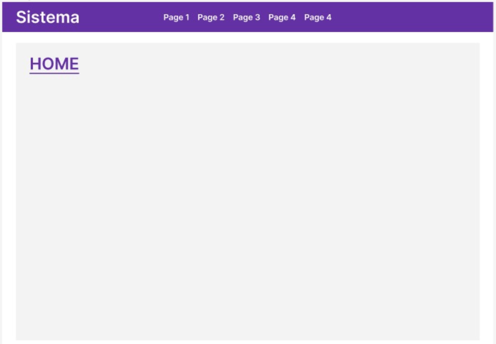
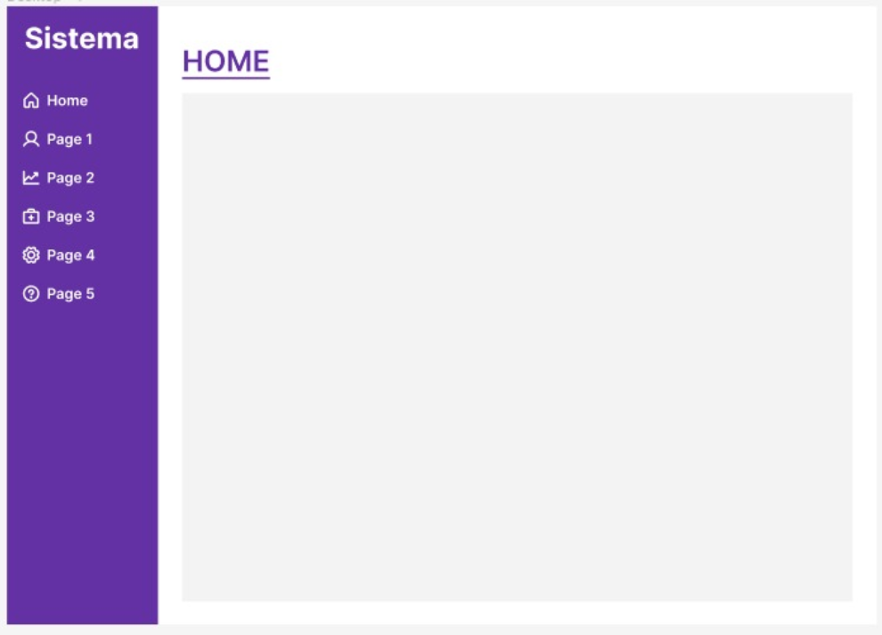
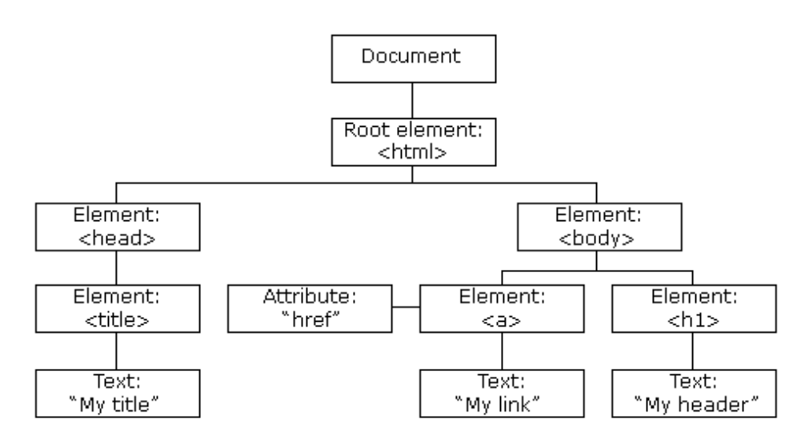

<!-- https://github.com/marp-team/marpit/issues/137 -->

<!-- _class: new-chapter -->


# JAVASCRIPT

---

### Conteúdos Abordados
<!-- _class: split -->

<div class=ldiv>

- [Introdução](#introducao)
- [Tipos de Dados](#tipos-de-dados)
- [Truthy e Falsy](#truthy-and-falsy)
- [Operadores](#operadores)
- [Estruturas para controle de Fluxo](#controle-de-fluxo)
- [Estruturas de Repetição](#estruturas-repeticao)
- [Estruturas para tratamento de erros](#tratamento-de-erros)
- [Trabalhando com Números](#trabalhando-com-numeros)
- [Trabalhando com Textos](#trabalhando-com-textos)
</div>
<div class=rdiv>

- [Trabalhando com Objetos](#trabalhando-com-objetos)
- [Coleções](#colecoes)
- [Expressões Regulares](#expressoes-regulares)
- [Trabalhando com Formulários](#trabalhando-com-formularios)
- [Ciclo de Vida em Formulários](#ciclo-de-vida-em-formularios)
- [DOM - Document Object Model](#dom)
- [BOM - Browser Object Model](#bom)
- [JS Assíncrono](#js-assincrono)
- [Boas Práticas](#boas-praticas)
- [Fontes](#fontes)
</div>

---

### Exercícios
<!-- _class: split -->

<div class=ldiv>

- [EXERCÍCIO I - Cálculo IMC](#calculo-imc)
- [EXERCÍCIO II - Adivinhe o nome](#adivinhe-o-nome)
- [EXERCÍCIO III - Média ponderada](#media-ponderada)
- [EXERCÍCIO IV - Ajude o Bart](#ajude-o-bart)
- [EXERCÍCIO V - Porta dos desesperados](#porta-dos-desesperados)
- [EXERCÍCIO VI - Refatoração](#refatoracao-anteriores)
- [EXERCÍCIO VII - Validação de dados](#validacao-de-dados)
- [EXERCÍCIO VIII - O campeão](#o-campeao)
- [EXERCÍCIO IX - Conversor / formatador de moedas](#conversor-de-moedas)
- [EXERCÍCIO X - Layout Básico I](#layout-basico-1)
- [EXERCÍCIO XI - Layout Básico II](#layout-basico-2)
- [EXERCÍCIO XII - Palíndromo](#palindromo)
- [EXERCÍCIO XIII - Porteiro da Balada](#porteiro-da-balada)
</div>
<div class=rdiv>

- [EXERCÍCIO XIV - Comparador case-insensitive](#comparador-case-insensitive)
- [EXERCÍCIO XV - E-mail do Compadre](#email-do-compadre)
- [EXERCÍCIO XVI - Protocolo de Atendimento](#protocolo-de-atendimento)
- [EXERCÍCIO XVII - Cadastro de Pessoas](#cadastro-de-pessoas)
- [EXERCÍCIO XVIII - Validações](#validacoes)
- [EXERCÍCIO XIX - Esqueci minha senha](#esqueci-minha-senha)
- [EXERCÍCIO XX - Ocultar dados pessoais em documento](#ocultar-dados-pessoais)
- [EXERCÍCIO XXI - Bloqueador de URLs](#bloqueador-de-urls)
- [EXERCÍCIO XXII - Trabalho Final do Curso](#trabalho-final)
</div>

---

<!-- _class: new-chapter -->
<!-- _paginate: false -->

## Introdução <span id="introducao"></span>

---

<!-- _class: left -->

## Características

1. Tipagem fraca e dinâmica
<br>
2. Case Sensitive
<br>
3. Estruturada, Orientada a Objetos e baseada em protótipos
<br>
4. Possui funções de primeira classe (podem ser atribuídas a variáveis, passadas por parâmetro e retorno)

---

<!-- _class: left -->

### Camadas do Desenvolvimento Web

1. Estrutura (HTML)
<br>
2. Aparência (CSS)
<br>
3. Comportamento (JS)

---

### Formas de Trabalhar com JS

1. Inline
<br>
2. Incorporado
<br>
3. Externo

---

### JS Inline

No JS inline, trabalhamos com JS diretamente no elemento HTML como um atributo (de acordo com o evento a ser programado).

```
<button onclick=”alert(‘Hello World!’);”>
Clicar
</button>
```

---

### JS Incorporado

No JS incorporado, trabalhamos com JS no mesmo arquivo HTML, dentro das TAGs ***<script>*** e ***</script>***.

```
<script>
function clicar() {
    alert(‘Hello World!’);
}
</script>

<button onclick=”clicar()”>Clicar</button>
```

---

### JS Externo

No JS externo, trabalhamos com JS em arquivo separado e importamos ele em nosso arquivo HTML na TAG `<script>` informando no atributo ***src*** o caminho do nosso script.

```
<script src="js/script.js" charset="UTF-8" defer></script>

<button onclick=”clicar()”>Clicar</button>
```

---

### Variáveis

- ***Regra***: Devem iniciar por letra, $ ou _
<br>

- ***Convenção***: utilizar padrão camelCase
<br>

- ***Declaração***: var, let ou const

---

<!-- _class: new-chapter -->
<!-- _paginate: false -->

## Tipos de Dados <span id="tipos-de-dados"></span>

---

### Tipos de Dados

- ***Primitivos***
    - Number
    - String
    - Boolean
    - Undefined
<br>
- ***Complexos***
    - Object
    - Function

---

### Tipos Primitivos

- São tipos ***definidos por um único dado*** (que não é um objeto com métodos ou propriedades).
<br>
- Em JS todos tipos primitivos ***são imutáveis***.
<br>
- Tipos primitivos não tem propriedades ou métodos, mas se comportam como se tivessem devido ao ***mecanismo de auto-boxing do JS***.

---

### Tipos Primitivos - Number

- Diferente de outras linguagens de programação, Javascript possui apenas um tipo de dado para trabalhar com números, o tipo ***Number***.
<br>
- Para definir um Number digitamos diretamente o número (sem aspas).
<br>
- Além de representar números, possui 3 valores simbólicos:
+Infinity, -Infinity e NaN (não número).

---

<!-- _class: small -->

### Tipos Primitivos - String

- Em Javascript para representar uma sequência de caracteres que define um texto, utilizamos o tipo ***String***.
<br>
- Para definir uma String podemos utilizar ***aspas simples***, ***aspas duplas*** ou ***crase*** (JS template literals).
<br>
- Strings são arrays de caracteres (zero indexados).
<br>
- Strings são imutáveis, toda alteração é na verdade uma nova atribuíção.
<br>
- Uma String vazia é definida apenas abrindo e fechando aspas (sem espaço).

---

### Tipos Primitivos - Boolean <a id="third-page"></a>

- Em Javascript para representar uma valor ***verdadeiro*** ou ***falso***, utilizamos o tipo ***Boolean***.
<br>
- Para definir um Boolean devemos utilizar as palavras reservadas ***true*** ou ***false***.

---

### Tipos Primitivos - Undefined

- Em Javascript, o tipo utilizado para definir um valor indefinido é o ***Undefined***.
<br>
- Quando uma variável não tem sua inicialização, a mesma é inicializada por padrão para ***undefined***.

---

## Tipos Complexos

São aqueles tipos definidos por estruturas mais complexas (entre chaves), que possuem mais de um valor ou ainda bloco de código executável.

---

<!-- _class: small -->

### Tipos Complexos - Object

- Em Javascript, ***um objeto é simplesmente uma coleção dinâmica de chaves e valores***, onde suas propriedades podem ser de qualquer tipo de dado.
<br>
- É possível adicionar/remover propriedades a qualquer momento.
<br>
- Para adicionar utiliza-se o operador ***"."***.
<br>
- Para remover, utiliza-se o operador ***"delete"***.
<br>
- ***OBS.:*** Um Array em Javascript é do tipo de dado Object, apenas possui uma sintaxe própria de construção e métodos e propriedades especiais.

---

<!-- _class: small -->

### Tipos Complexos - Object

***Declaração Literal:***
```
var fernando = {
	nome: “Fernando”,
	sobrenome: “Schneider”
};
```
<br>

***Declaração contrutor de Object:***
```
var fernando = new Object();
fernando.nome: “Fernando”;
fernando.sobrenome: “Schneider”;
```

---

<!-- _class: small -->

### Tipos Complexos - Object

***Lendo / atribuindo valores:***
```
var nome = pessoa.nome;
pessoa.nome = “Fernando”;

var nome = pessoa[‘nome’];
pessoa[‘nome’] = “Fernando”;
```
<br>

***Apagando propriedades (chaves) e valores:***
```
delete pessoa.nome;
```

---

<!-- _class: small -->

### Tipos Complexos - Object

***CUIDADO AO MANIPULAR OBJETOS***

```
// Errado:
var pessoa = {};
pessoa.nome = “Fernando”;
pessoa.endereco.logradouro = “Avenida Ipiranga”;

// Correto:
var pessoa = {};
pessoa.nome = “Fernando”;
pessoa.endereco = {};
pessoa.endereco.logradouro = “Avenida Ipiranga”;
```

---

<!-- _class: small -->

### Tipos Complexos - Function

- Em Javascript, uma função também é considerada um tipo de dado, ***Function***.
<br>
- É um tipo de dado que contém uma estrutura de código isolada executável.
<br>
- São muito poderosas, podem simular classes, construtores, módulos e métodos.

---

<!-- _class: small -->

### Tipos Complexos - Function

- São de 1º classe, podendo ser atribuídas a variáveis, passadas por parâmetro e retornadas por outras funções.
<br>
- Podem ser escritas de diferentes formas: ***function declaration***, ***function expression***, **named function expression** e **arrow function**.

---

<!-- _class: small -->

### Tipos Complexos - Function
##### (function declaration)

- Forma mais tradicional de escrita
- Pode ser invocada antes (acima no código) de sua declaração
<br>

**Sintaxe**
```
function soma(a, b) {
	return a+b;
}
```

---

<!-- _class: small -->

### Tipos Complexos - Function 
##### (function expression)

- A função é declarada sendo atribuída a uma variável
- Deve ser declarada antes (acima no código) de seu uso
<br>

**Sintaxe**
```
let soma = function (a, b) {
	return a+b;
}
```

---

<!-- _class: small -->

### Tipos Complexos - Function 
##### (named function expression)

- Idem a function expression, porém a função atribuída à variável é nomeada
- Ajuda em operações de debug ou em análise de logs (pois a referência estará nomeada)
<br>

**Sintaxe**
```
let soma = function soma (a, b) {
	return a+b;
}
```

---

<!-- _class: small -->

### Tipos Complexos - Function 
##### (arrow function)

- Forma mais enxuta de escrita, muito usada em Callbacks
- Quando possui uma única linha, o retorno explícito pode ser omitido
<br>

**Sintaxe**
```
var soma = (a, b) => (a+b);

var soma = (a,b) => {
	return a+b;
}
```

---

<!-- _class: small -->

### Tipos Complexos - Function 
##### Patterns - Função Fábrica

- Neste pattern, basicamente a função deverá criar um objeto literal e retornar. 

```
let criarPessoa(nome, sobrenome) {
	return {
		nome: nome,
		sobrenome: sobrenome
	};
}

let fernando = criarPessoa(‘Fernando’, ‘Schneider’);
```

---

<!-- _class: small -->

### Tipos Complexos - Function 
##### Patterns - Função Construtora

- Neste pattern, deve-se invocar a função através do operador especial ***new***. 
- O operador ***new*** cria um objeto implícito na sua chamada, fazendo com que o ***this*** utilizado na definição da função passe a considerar o objeto.

```
let Pessoa = function(nome, sobrenome) {
	this.nome = nome;
	this.sobrenome = sobrenome;
}

let fernando = new Pessoa(‘Fernando’, ‘Schneider’);
```

---

<!-- _class: new-chapter -->
<!-- _paginate: false -->

## Truthy e Falsy <span id="truthy-and-falsy"></span>

---

<!-- _class: small -->

### Truthy e Falsy

- Em Javascript, alguns valores quando encontrados em ***contextos de avaliações booleanas*** podem assumir o que chamamos de ***truthy*** ou de ***falsy***.
<br>

- ***Truthy***
    - Um valor ***truthy***, é um valor que quando avaliado em contexto de avaliação booleana é considerado ***true*** (verdadeiro).

- ***Falsy***
    - Um valor ***falsy***, é um valor que quando avaliado em contexto de avaliação booleana é considerado ***false*** (falso).

---

<!-- _class: small -->

### Truthy e Falsy

- ***Falsy*** - São avaliados como ***false*** os seguintes valores
    - undefined
    - null
    - false
    - NaN
    - 0
    - ‘’

- ***Truthy*** - São avaliados como ***true*** todo resto
    - Todo o resto, inclusive ***Arrays*** e ***Objetos vazios***.

---

<!-- _class: new-chapter -->
<!-- _paginate: false -->

## Operadores <span -d="operadores"></span>

---

<!-- _class: small -->

### Operadores

- Em Javascript, os operadores podem ser classificados em ***Tipos*** e **Categorias**.
<br>

- ***Tipos***
    - Unários (apenas 1 operando)
    - Binários (2 operandos)
    - Ternários (3 operandos)

- ***Categorias***
    - Aritméticos
    - Lógicos
    - Comparação
    - Atribuição
    - Especiais
    - Bit a Bit

---

## Operadores Aritméticos

Operadores utilizados para realizar operações matemáticas

---

<!-- _class: small -->

| Operador | Descrição | Categoria |
| -------- | --------- | --------- |
| **+** | Adição | Binário |
| **-** | Subtração | Binário |
| **\*** | Multiplicação | Binário |
| **/** | Divisão | Binário |
| **%** | Módulo | Binário |
| **+** | Positivo (troca sinal) | Unário |
| **-** | Negativo (troca sinal) | Unário |
| **++** | Incremento (soma 1) | Unário |
| **--** | Decremento (subtrai 1) | Unário |

---

## Operadores Lógicos

Operadores utilizados para realizar expressões lógicas

---

<!-- _class: small -->

| Operador | Descrição | Categoria |
| -------- | --------- | --------- |
| **&&** | AND | Binário |
| **\|\|** | OR | Binário |
| **!** | NOT | Binário |

---

## Operadores de Comparação

Operadores utilizados para realização de comparações e equivalências

---

<!-- _class: small -->

| Operador | Descrição | Categoria |
| -------- | --------- | --------- |
| **==** | Igual | Binário |
| **===** | Idêntico | Binário |
| **!=** | Diferente | Binário |
| **!==** | Não idêntico | Binário |
| **>** | Maior | Binário |
| **<** | Menor | Binário |
| **>=** | Maior ou igual | Binário |
| **<=** | Menor ou igual | Binário |

---

## Operadores de Atribuição

Operadores utilizados para realização de operações de atribuição de valores

São na verdade uma maneira simplificada de atribuir o resultado de uma operação matemática a um operando.

---

| Operador | Descrição | Categoria |
| -------- | --------- | --------- |
| **+=** | Soma e atribui o resultado | Binário |
| **-=** | Subtrai e atribui o resultado | Binário |
| **\*=** | Multiplica e atribui o resultado | Binário |
| **\/=** | Divide e atribui o resultado | Binário |
| **%=** | Calcula o resto e atribui o resultado | Binário |

---

## Operadores Especiais

Operadores utilizados para realização de operações especiais da linguagem JS

---

<!-- _class: ultra-small -->

| Operador | Descrição | Categoria | Exemplo |
| -------- | --------- | --------- | ------- |
| **?:** | Operador condicional | Ternário | (a == b) ? true : false;
| **,** | Separa expressões avaliadas | Binário |  var nome = 'Fernando', idade = 35; |
| **delete** | Apaga operando | Unário | delete pessoa.nome |
| **in** | Indica se existe propriedade específica | Binário | nome in objPessoa |
| **typeof** | Retorna o tipo de dado | Unário | typeof "fernando" |
| **instanceof** | Verifica se um objeto é da instância | Binário | objPessoa instanceof Pessoa |
| **new** | Cria nova instância de um objeto | Unário | new Pessoa() |
| **this** | Referencia objeto atual | Unário | this.nome |
| **()** | Invocador de função| Unário | minhaFuncao() |

---

## Operador Condicional

Operador utilizado para avaliar condições

---

<!-- _class: small -->

### Operador Condicional

- Operador condicional é o único operador JavaScript que utiliza três operandos

- O operador pode ter um de dois valores baseados em uma condição.

- Comumente chamado de operador ternário.

- **Sintaxe**
    ```
    condição ? true : false;
    ```

- **Exemplo**
    ```
    let status = (idade >= 18) ? "adulto" : "menor de idade";
    ```


---

<!-- _class: new-chapter -->
<!-- _paginate: false -->

## Estruturas para controle de Fluxo <span id="controle-de-fluxo"></span>

---

<!-- _class: small -->

### Estruturas para controle de Fluxo

- São estruturas de bloco (definidas entre chaves {...}) e utilizadas para controlar o fluxo de execução do código.
<br>

- Podem ser: 
    - ***Estruturas condicionais***
    - ***Estruturas de repetição***
    - ***Estruturas para tratamento de erros***.

---

<!-- _class: small -->

### Estruturas condicionais

- São estruturas de controle de fluxo baseadas numa condição.
<br>
- Dependendo da condição, o fluxo de execução é direcionado para que um determinado bloco de código seja executado.
<br>
- São elas:
    - ***if…else***
    - ***switch***
    - ***Operador ternário*** (este não chega a ser uma estrutura)

---

<!-- _class: small -->

### if...else

- Declaração usada para validar uma expressão, caso verdadeiro executará o bloco dentro da expressão ***if***, caso contrário executará o bloco dentro da expressão ***else***.

- Permite múltiplas condições através do encadeamento de múltiplos IFs e ELSEs.

- ***Sintaxe***
```
if (condição) {
	código para executar se condição for atendida
} else {
	código para executar caso condição não seja atendida
}
```

---

<!-- _class: small -->

### switch

- Declaração usada para comparar um valor, diferentemente do ***if***, o ***switch*** testa apenas a equivalência.

- Permite uso de múltiplas condições através da palavra reservada ***case*** com uma mesma instrução a ser executada.

- Permite o uso de valor padrão, através da palavra reservada ***default***.

- A palavra reservada ***break*** trava o fluxo de execução de todo bloco switch.

---

<!-- _class: small -->

### switch

- ***Sintaxe***
```
switch (variável) {
	case valor1:
		// Expressão executada caso valor1;
		break;
	case valor2:
		// Expressão executada caso valor2;
		break;
	case valorN:
		// Expressão executada caso valorN;
		break;
	default:
		// Expressão executada caso nenhuma das anteriores;
}
```

---

<!-- _class: small -->

### switch

- ***Permite executar uma mesma expressão para múltiplos casos***
```
switch (variável) {
	case valor1:
		// Expressão executada caso valor1;
		break;
	case valor2:
	case valor3:
	case valor4:
		// Expressão executada caso valor2 ou valor3 ou valor4;
		break;
	case valorN:
		// Expressão executada caso valorN;
		break;
	default:
		// Expressão executada caso nenhuma das anteriores;
}
```

---

<!-- _class: exercise -->

### EXERCÍCIO I - Cálculo IMC <span id="calculo-imc"></span>

O IMC é reconhecido como padrão internacional para avaliar o grau de sobrepeso e obesidade. É calculado dividindo o peso (em kg) pela altura ao quadrado (em metros).
`IMC = Peso ÷ (Altura × Altura)`

Obtenha o valor do peso em KG e da altura em metros, realize o cálculo e apresente ao usuário (de acordo com tabela abaixo):
Menor que 18,5 = abaixo do peso.
- Entre 18,5 e 24,9 = peso normal.
- Entre 25 e 29,9 = sobrepeso.
- Entre 30 e 34,99 = obesidade grau I.
- Entre 35 e 39,99 = obesidade grau II (severa).
- Acima de 40 = obesidade grau III (mórbida).

---

<!-- _class: exercise -->

### EXERCÍCIO II - Adivinhe o nome <span id="adivinhe-o-nome"></span>

Exiba uma mensagem de boas vindas ao usuário e informe uma lista de 10 nomes.

Dentre estes nomes, um você já terá com selecionado em seu sistema.

Peça que o usuário adivinhe qual o nome escolhido, escolhendo uma das opções.

1. Caso ele escolha o nome correto, exiba a mensagem: 
    - Parabéns, você venceu! Escolheu o nome correto.

2. Caso ele escolha o nome incorreto, exiba a mensagem:
    - Tente novamente mais tarde.

---

<!-- _class: exercise -->

### EXERCÍCIO III - Média ponderada <span id="media-ponderada"></span>

Construa um programa que obtém 2 notas de um dado aluno e realiza a média ponderada.

Para média ponderada, considere que a ***nota1 terá peso 1*** e a ***nota2 terá peso 2***.

1. Caso a média esteja igual ou maior que 7, exiba:
    - Parabéns, você foi aprovado!

2. Caso a média seja menor que 7, exiba:
    - Infelizmente você foi reprovado.

---

<!-- _class: new-chapter -->
<!-- _paginate: false -->

## Estruturas de repetição <span id="estruturas-repeticao"></span>

---

<!-- _class: small -->

### Estruturas de repetição

- São estruturas de controle de fluxo baseadas numa condição para repetição de um bloco de código.

- O fluxo de execução de um bloco de código será repetido até que uma condição seja atendida.

- São elas:
    - for
    - for...in
    - for...of
    - while
    - do...while

---

<!-- _class: small -->

### For

- Clássica estrutura para realização loops.

- Repete uma dada instrução (dentro do bloco) até que a condição seja atendida.

- Estrutura composta por:
    - Inicialização
    - Condição
    - Atualização

---

<!-- _class: small -->

### For

- ***Sintaxe***
```
for (INICIALIZAÇÃO; CONDIÇÃO; ATUALIZAÇÃO) { 
    // INSTRUÇÔES...
}
```

- ***Exemplo***
```
for (let i = 0; i < 10; i++) { 
    console.log('Valor: ' + i); 
}
```

---

<!-- _class: small -->

### For...in

- Modelo diferente de for, utilizado para iterar objetos e arrays.
<br>
- Em Arrays, a cada iteração recebe o próximo índice.
<br>
- Em objetos, a cada iteração recebe a próxima propriedade.

---

<!-- _class: small -->

### For...in

- ***Sintaxe***
```
for (let index in array) {  instruções... }

for (let property in obj) { instruções... }
```

- ***Exemplos***
```
for (let index in numeros) { 
	console.log('Número: ' + numeros[index]); 
}

for (let prop in obj) { 
	console.log('Propriedade: ' + obj[prop]); 
}
```

---

<!-- _class: small -->

### For...of

- Modelo diferente de for, utilizado para iterar arrays.

- A cada iteração recebe o próximo item (diferente do for…in que recebe o próximo index).

- ***Não permite a iteração de objetos!***

---

<!-- _class: small -->

### For...of

- ***Sintaxe***
```
for (let value of array) { instruções… }
```

- ***Exemplos***
```
for (let item of numeros) { 
	console.log('Número: ' + item); 
}

for (let pessoa of pessoas) { 
	console.log('Nome: ' + obj.nome); 
}
```

---

<!-- _class: small -->

### While

- Estrutura de repetição baseada em condição.

- Normalmente utilizada quando ***não se sabe quantas vezes se deseja executar*** um dado código, mas sabe-se qual a condição de parada (ocorrência de algo).

- ***Sintaxe***
```
while (condição) { instruções até que condição seja atingida }
```

- ***Exemplo***
```
while (opcao != 'sair') {
	console.log('Você escolheu a opção: ' + opcao);
}
```

---

<!-- _class: small -->

### Do...While

- Muito parecida com ***While***, porém garante a execução de pelo menos 1x o bloco de instruções.

- ***Sintaxe***
```
do {
	// instruções até que condição seja atingida
} while(condição);
```

- ***Exemplo***
```
do {
	jogarMoeda();
} while(moedaSelecionada == 'cara');
```

---

<!-- _class: exercise -->

### EXERCÍCIO IV - Ajude o Bart <span id="ajude-o-bart"></span>

- Bart Simpson frequentemente apronta na escole e precisa escrever repetidas frases no quadro.

- Desta vez ele precisa escrever intercaladamente as seguintes frases até encher o quadro.

- Pergunte ao Bart quais as 2 frases que ele precisa escrever, por exemplo:
    1. ***“Não andarei de skate no corredor da escola”***
    2. ***“Eu não vou encorajar o Ralph a voar”***

- Sabendo que para encher o quadro é preciso escrever cada uma das frases ao menos 25 vezes, ajude o Bart a concluir esta tarefa.

---

<!-- _class: exercise -->

### EXERCÍCIO V - Porta dos desesperados <span id="porta-dos-desesperados"></span>

- Construa um programa que exiba 6 opções para que o usuário escolha:
    1. Porta 1
    2. Porta 2
    3. Porta 3
    4. Porta 4
    5. Porta 5
    6. Sair

- Somente a ***porta 4 terá o prêmio***e somente a ***porta 3 terá o monstro***, as demais portas não terão nada e a opção 6 é de sair.

- O programa deve apresentar ao usuário uma tela para que escolha uma das portas até que ele encontro o prêmio (exibindo ***"Você ficou milionário!"***), o monstro (exibindo ***"Você foi devorado."***) ou escolhendo sair (***"Você desistiu de competir."***).

- Lembre-se que uma porta aberta não deve mais ser apresentada ao usuário.

---

<!-- _class: exercise -->

### EXERCÍCIO VI - Refatoração <span id="refatoracao-anteriores"></span>

- Realize a refatoração dos exercícios anteriores, adicionando seus novos conhecimentos sobre lações de repetição.

- Utilize os laços de repetição para melhorar a escrita dos códigos do seus exercícios anteriores.

- **Por exemplo:** Sempre que tiver que escrever algo de forma repetida, seja na camada de comportamento (JS) ou em tela (HTML), utilize algum dos laços de repetição aprendidos. 

---

<!-- _class: new-chapter -->
<!-- _paginate: false -->

## Estruturas para tratamento de erros <span id="tratamento-de-erros"></span>

---

<!-- _class: small -->

### Estruturas para tratamento de erros

- São estruturas de controle de fluxo baseadas na ocorrência ou não de erros para execução de um bloco de código.

- Dependendo da ocorrência ou não de algum erro, o fluxo de execução é direcionado para que um determinado bloco de código seja executado.

- São elas:
    - ***try***
    - ***catch***
    - ***finally***
    - ***throw***

---

<!-- _class: small -->

### Estruturas para tratamento de erros

- São estruturas para tratar erros e exceções de maneira elegante.

- ***try***
    - É onde colocamos o código que de fato queremos executar (caminho feliz).
- ***catch***
    - Caso ocorra erro em alguma instrução no bloco TRY, o erro pode ser capturado e tratado no bloco CATCH.
- ***throw***
    - Usado para lançar exceções conforme desejado.
- ***finally***
    - É executado independentemente da ocorrẽncia ou não de erros.

---

<!-- _class: small -->

### Estruturas para tratamento de erros

- ***Sintaxe***
```
try {
	// instruções que deseja-se executar
	// aqui pode ser lançado algo com throw
} catch (error) {
	// instruções caso ocorra algum erro no bloco try
} finally {
	// instruções executadas independentemente da ocorrência de erros
}
```

---

<!-- _class: small -->

### Estruturas para tratamento de erros

- ***Exemplo***
```
try {
	const status = criarSolicitacao();
	if (status == 'BLOCK') throw new Error('Solicitação bloqueada');
catch (error) {
	console.log('Error: ' + error);
	showPopup(error.message);
} finally {
	retornarTelaAnterior();
}
```

---

<!-- _class: exercise -->

### EXERCÍCIO VII - Validação de dados <span id="validacao-de-dados"></span>

- Você foi contratado para criar um formulário básico de inscrição para um concurso de talentos. Este formulário deve exigir apenas os campos nome, idade e e-mail. 

- Utilize as estruturas para tratamento de erros estudadas e crie uma função para validação dos dados enviados e apresentação dos erros ao usuário, sendo que:
    1. Nome não pode ser vazio e não pode ser numérico
    2. Idade não pode ser vazio e deve ser numérico
    3. E-mail não pode ser vazio e não pode começar com números

- Caso atendido os requisitos, apresentar a mensagem de cadastro realizado com sucesso e exibir os dados em tela.

- ***OBS.:*** Não faremos ainda uma validação mais profunda de e-mail pois veremos isso em expressões regulares.

---

<!-- _class: new-chapter -->
<!-- _paginate: false -->

## Trabalhando com Números <span id="trabalhando-com-numeros"></span>

---

<!-- _class: small -->

### Trabalhando com Números

- ***Coerção Numérica***
    - Antes de aprender sobre como trabalhar com números, é importante lembrar da coerção numérica.
    - Coerção é o mecanismo de auto conversão que ocorre em operações numéricas no JS.
    - Tenha cuidado com o mecanismo de coerção de números do JS.

- Em operações numéricas, o mecanismo de coerção atua, sendo que:
    - undefined é avaliado como NaN
    - null é avaliado como 0
    - true é avaliado como 1 
    - false é avaliado como 0
    - strings são parseadas podendo transformar em number ou NaN

---

### Trabalhando com Números

- Em JS, para trabalharmos com números temos como principais recursos nativos da linguagem:
    <br>
    - A classe utilitária ***Number*** (que realiza o auto-boxing do tipo primitivo number)
    <br>
    - A biblioteca ***Math API***

---

<!-- _class: small -->

### Number

É a classe utilitária que realiza o ***auto-boxing*** do tipo primitivo "number".
<br>
Possui propriedades e métodos (estáticos e de instância) que nos auxiliam a manipular números.

---

<!-- _class: small -->

### Number - Propriedades Estáticas (constantes)

- ***Number.MIN_VALUE***
    - Retorna o menor número válido (5e-324).
    - Valores menores que isso, são alterados para o símbolo -Infinity.
- ***Number.MAX_VALUE***
    - Retorna o maior número válido (1.7976931348623157e+308).
    - Valores maiores que isso, são alterados para o símbolo Infinity.
- ***Number.NaN***
    - Retorna o valor NaN.

---

<!-- _class: small -->

### Number - Propriedades Estáticas (constantes)

- ***Number.MIN_SAFE_INTEGER***
    - Retorna o menor número inteiro válido (-9007199254740991).
- ***Number.MAX_SAFE_INTEGER***
    - Retorna o maior número inteiro válido (9007199254740991).
- ***Number.POSITIVE_INFINITY***
    - Retorna o valor Infinity.
- ***Number.NEGATIVE_INFINITY***
    - Retorna o valor -Infinity.

---

<!-- _class: small -->

### Number - Métodos Estáticos (funções)

- ***Number.isNaN(number)***
    - Verifica se o número passado no parâmetro é um NaN.
    - Retorna true ou false.
- ***Number.isFinite(number)***
    - Verifica se o número passado no parâmetro é finito.
    - Retorna true ou false.
- ***Number.isInteger(number)***
    - Verifica se o número passado no parâmetro é um inteiro.
    - Retorna true ou false.
- ***Number.isSafeInteger(number)***
    - Verifica se o número passado no parâmetro é um inteiro válido no JS (entre o menor e maior válidos).
    - Retorna true ou false.

---

<!-- _class: small -->

### Métodos Estáticos (funções)

- ***Number.parseInt(number|"string")***
    - Retorna a parte inteira do número ou string.
    - Exatamente igual a função global "parseInt".
    - ***Cuidado:*** se começar com número, ele consegue converter e desprezar o texto.
- ***Number.parseFloat(number|"string")***
    - Retorna o valor de ponto flutuante do número ou string.
    - Exatamente igual a função global "parseFloat".
    - ***Cuidado:*** se começar com número, ele consegue converter e desprezar o texto.

---

<!-- _class: small -->

### Métodos Ede Instância

- ***(number).toString()***
    - Retorna uma String com exato valor do número informado.
    - Este método é herdado de “Object”, estando presente em todos objetos (inclusive na Wrapper class Number).
- ***(number).valueOf()***
    - Retorna um number (o dado primitivo) do exato número.
- ***(number).toLocaleString(locale, options)***
    - Formata um número numa String, baseado no local e opções informados.
    - Exemplo: (11).toLocaleString('pt-BR', { style: 'currency', currency: 'BRL'}); // retorna "R$ 11,00"
    - ***Mais Detalhes:*** https://www.w3schools.com/jsref/jsref_tolocalestring_number.asp 

---

<!-- _class: small -->

### Métodos Ede Instância

- ***(number).toExponential()***
    - Retorna uma String contendo o número representado em notação exponencial.
- ***(number).toFixed()***
    - Retorna uma String com o valor inteiro do número arredondado.
    - Se a parte decimal for maior ou igual a 5, arredonda para cima.
    - Se a parte decimal for menor ou igial a 4, arredonda para baixo.
- ***(number).toPrecision()***
    - Retorna uma String do número informado na precisão especificada.
    - Exemplo: (11).toPrecision(4); // retorna "11.00" (precisão de 4 dígitos)

---

<!-- _class: small -->

### Math API

- É uma biblioteca utilitária do Javascript, portanto não possui construtor, ***seus métodos são todos estáticos***.
<br>
- Tem por objetivo auxiliar na resolução de problemas matemáticos.
<br>
- Disponibiliza uma gama de constantes e funções para tratamento de números e operações matemáticas.

---

<!-- _class: small -->

### Math API - Constantes

- ***Math.PI*** = Valor de PI
- ***Math.E*** = Número de Euler
- ***Math.LN2*** = Logaritmo natural de 2
- ***Math.LN10*** = Logaritmo natural de 10
- ***Math.LOG2E*** = Logarítmo de E na base 2
- ***Math.LOG10E*** = Logarítmo de E na base 10
- ***Math.SQRT1_2*** = Raíz quadrada de 1/2
- ***Math.SQRT2*** = Raíz quadrada de 2

---

<!-- _class: small -->

### Math API - Métodos (Mínimo e Máximo)

- ***Math.min(nums…)***
    - Retorna o número de menor valor dentro de um conjunto.
    - Math.min(2,3,4,5,6)

- ***Math.max(nums…)***
    - Retorna o número de maior valor dentro de um conjunto.
    - Math.max(2,3,4,5,6)

---

<!-- _class: small -->

### Math API - Métodos (Arredondamento)

- ***Math.round(num)***
    - Arredonda o número informado para o inteiro mais próximo.
    - Math.round(3.7) // Retorna 4

- ***Math.floor(num)***
    - Arredonda o número informado para o inteiro para baixo.
    - Math.floor(3.7) // Retorna 3

- ***Math.ceil(num)***
    - Arredonda o número informado para o inteiro para cima.
    - Math.ceil(3.7) // Retorna 4

- ***Math.trunc(num)***
    - Retorna a parte inteira de um número (despreza as casas decimais, não é exatamente um arredondamento).
    - Math.trunc(3.3) // Retorna 3

---

<!-- _class: small -->

### Math API - Métodos (Valor randômico)

- ***Math.random()***
    - Retorna um número dinâmico entre 0 e 1
    - Math.random();
    - Você pode usar a multiplicação e o arredondamento para chegar em qualquer conjunto randômico desejado.

---

<!-- _class: small -->

### Math API - Métodos (Cálculo)

- ***Math.pow(base, expoente)***
    - Retorna o valor de um número elevado à potência.
    - Math.pow(2, 3) // Retorna 8

- ***Math.sqrt(num)***
    - Retorna a raiz quadrada de um número.
    - Math.sqrt(4) // Retorna 2

- ***Math.exp(num)***
    - Eleva o número de Euler a potência que passarmos no parâmetro.
    - Math.exp(3)

---

<!-- _class: small -->

### Math API - Métodos (Cálculo)

- ***Math.log(num)***
    - Retorna o logaritmo natural do parâmetro.
    - Math.log(3)
- ***Math.sin(num)***
    - Retorna o valor do seno do número informado.
    - Math.sin(3)
- ***Math.cos(num)***
    - Retorna o valor do cosseno do número informado.
    - Math.cos(3)

---

<!-- _class: small -->

### Math API - Métodos (Cálculo)

- ***Math.tan(num)***
    - Retorna o valor da tangente do número informado.
    - Math.tan(3)

- ***Math.asin(num)***
    - Retorna um valor numérico em radianos cujo arco seja passado por parâmetro na função.
    - Math.asin(3)

---

<!-- _class: small -->

### Math API - Métodos (Cálculo)

- ***Math.atan(num)***
    - Retorna um valor numérico em radianos cujo a tangente seja passado por parâmetro na função.
    - Math.atan(3)
- ***Math.atan2(n1, n2)***
    - Retorna um valor numérico entre -PI e PI cujo tangente é igual ao quociente dos 2 números passados por parâmetro.
    - Math.atan2(5, 10)

---

<!-- _class: exercise -->

### EXERCÍCIO VIII - O campeão <span id="o-campeao"></span>

- Construa uma aplicação que solicite nome e nota de diversas pessoas (1 até N) até que o usuário clique no botão ***Quem é o campeão***.

- Exiba em tela o nome e a nota do campeão.

- ***OBS.:*** Utilize métodos da Math API para solucionar o caso.

---

<!-- _class: exercise -->

### EXERCÍCIO IX - Conversor / formatador de moedas <span id="conversor-de-moedas"></span>


- Pesquise no Google o valor destas 3 moedas:
    - Dolar americano
    - Euro
    - Libra esterlina

- Peça que o usuário informe um valor em real (a ser convertido).

- Converta o valor para cada uma das moedas.

- Formate a exibição de acordo com padrão de cada moeda e apresente o resultado ao usuário.

- **OBS.:** Utilize métodos da Math API para solucionar o caso.
- **OBS,2:** Não esqueça de realizar as validações e apresentar os erros ao usuário.

---

<!-- _class: exercise -->

### EXERCÍCIO X <span id="layout-basico-1"></span>
##### Layout básico I

- Reproduza o layout demonstrado abaixo.

- O objetivo aqui é praticar HTML e CSS.

- Sinta-se a vontade em melhorar o layout ou utilizar Javascript.


---

<!-- _class: exercise -->



---

<!-- _class: exercise -->

### EXERCÍCIO XI <span id="layout-basico-2"></span>
##### Layout básico II

- Reproduza o layout demonstrado abaixo.

- O objetivo aqui é praticar HTML e CSS.

- Sinta-se a vontade em melhorar o layout ou utilizar Javascript.

---

<!-- _class: exercise -->



---

<!-- _class: new-chapter -->
<!-- _paginate: false -->

## Trabalhando com Textos <span id="trabalhando-com-textos"></span>

---

String API (documentar)

---

<!-- _class: exercise -->

### EXERCÍCIO XII <span id="palindromo"></span>
##### Palíndromo

- Verificar se uma palavra digitada é um palíndromo.

- Escreva um programa que solicita que um usuário digite uma palavra.

- O programa deve verificar se a palavra digitada é um palíndromo ou não e apresentar o resultado.

- Não se esqueça de fazer algumas validações.

---

<!-- _class: exercise -->

### EXERCÍCIO XIII <span id="porteiro-da-balada"></span>
##### Porteiro da balada

- Escreva um programa que simule um porteiro de balada para maiores de idade (18+).

- Você deve solicitar o nome e a data de nascimento de uma pessoa, verificar se ela pode entrar na festa e apresentar o resultado.

- ***OBS.:*** Embora exista um objeto para trabalhar com datas no Javascript, ainda não estudamos. Por hora resolva este problema utilizando os tipos primitivos estudados.

---

<!-- _class: exercise -->

### EXERCÍCIO XIV <span id="comparador-case-insensitive"></span>
##### Comparador case-insensitive

- Escreva um programa que receba 2 textos digitados e compare eles informando se são equivalentes ou não.

- ***Detalhe:*** este seu comparador deve ser case-insensitive e não considerar acentos, por exemplo:
    1. "mar" deve ser considerado igual a "MAR" ou "Mar" ou "mAr", etc.
    2. "táxi" deve ser considerado igual a “taxi” ou "TÁXI" ou "TaXi" ou "tÁxi", etc. 

---

<!-- _class: exercise -->

### EXERCÍCIO XV <span id="email-do-compadre"></span>
##### E-Mail do compadre

- Você recebeu o e-mail com texto contido no próximo slide do seu compadre (Washington).

- Faça um programa que destaque a palavra "Tchan" (ou que permita escolher qual palavra destacar) todas vezes que aparecerem no texto de seu compadre.

- Para destacar a palavra use sua criatividade, deixe em negrito, em maiúscula, sublinhe, passe para vermelho, fique a vontade na escolha de seu destaque.

- Pegue o texto do e-mail que seu compadre mandou no próximo slide.
    - [Texto do compadre](../assets/files/exercicio-XV_email-do-compadre.txt)
    <br>
    - Caso não consiga baixar no link, o arquivo está em:
        - `../assets/files/exercicio-XV_email-do-compadre.txt`

---

<!-- _class: exercise -->

### EXERCÍCIO XVI <span id="protocolo-de-atendimento"></span>
##### Protocolo de atendimento

- Você foi contratado para criar uma função que gera protocolos de atendimento para uma empresa de callcenter.
- Estes protocolos não podem se repetir. 
- Devem ter o padrão `XXXXX-XX-XX`, sendo que:
    - Os primeiros 5 dígitos devem ser um valor sequencial único (ter obrigatoriamente 5 dígitos)
    - Os primeiros 2 dígitos após o primeiro hífen devem referenciar ao ano corrente
    - Os últimos 2 dígitos são dígitos verificadores, sendo que:
    - O primeiro dígito verificador corresponde a soma dos 5 primeiros dígitos
    - Se maior que 9, então deverá manter 9, caso contrário manter o próprio número
    - O segundo dígito deve ser:
        - Igual a 1 caso o anterior seja entre 0 e 4
        - Igual a 2 caso o anterior seja entre 5 e 9

---

<!-- _class: exercise -->

### EXERCÍCIO XVII <span id="cadastro-de-pessoas"></span>
##### Cadastro de pessoas

- Você foi contratado para desenvolver um sistema que realiza cadastro de pessoas.
- Este cadastro deve conter:
    1. Nome completo
    2. Idade
    3. CPF
    4. E-mail
    5. Celular

- Ao registrar a pessoa no sistema, você deverá salvar numa lista de pessoas exibindo a lista de pessoas na tela.

- Seu sistema também deve ter a opção de filtrar/pesquisar uma pessoa pelo "Nome", "E-mail" ou "CPF".

---

<!-- _class: new-chapter -->
<!-- _paginate: false -->

## Trabalhando com Objetos <span id="trabalhando-com-objetos"></span>

---

- Criando e usando seus proprios objetos
- Objetos especiais do JS
- Exercícios
    - Implementar método equals
    - Ver formas de comparar objetos (após exercicios somente)
    - Ver formas de criar/simular classes

---

<!-- _class: small -->

### Objetos Especiais

- Data
- Array
- Map
- Set
- JSON
- Error
- URL (web API)
- Regex 
    - Citar que também é um objeto especial, mas tratar em sessão à parte

---

<!-- _class: small -->

### Objetos Especiais
##### Arrays (sessão coleçoes ?)

- Documentar API Array
    - Exercicio: Bom dia generator
    - Exercício: reserva de poltrona
    - Exercício: sortear letra do alfabeto brasileiro

---

<!-- _class: small -->

### Objetos Especiais
##### Date

- O que é um timestamp
- Locales
- Criando datas
- Convertendo datas
- Formatando e exibindo datas
- Calculando diferença entre datas

---

<!-- _class: new-chapter -->
<!-- _paginate: false -->

## Coleções <span id="colecoes"></span>

---

<!-- _class: small -->

### Coleções - Arrays

---

<!-- _class: small -->

### Coleções - Set

---

<!-- _class: small -->

### Coleções - Map

---

<!-- _class: new-chapter -->
<!-- _paginate: false -->

## Expressões Regulares <span id="expressoes-regulares"></span>

---

<!-- _class: small -->

### Expressões Regulares

- São uma sequência de caracteres que especificam um padrão.

- Servem para **validar**, **extrair** ou **substituir** caracteres dentro de alguma string / texto.

---

<!-- _class: small -->

### Expressões Regulares
##### Validação

- Talvez o caso mais utilizado.
- Muito usadas para validar campos de formulário.
    - Verificar se um email está de acordo com padrão.
    - Verificar se uma senha atende aos critérios mínimos.
    - Verificar se um CPF atende aos requisitos.

---

<!-- _class: small -->

### Expressões Regulares
##### Extração (pesquisas avançadas)

- Podem ser usadas para extrair sequência de caracteres que atendem a um padrão dentro de uma string / texto.

- ***Por exemplo:***
    - Buscar todos os CPFs dentro de um dado texto.
    - Buscar todos os E-mails dentro de um dado texto.
    - Buscar todas as placas de carro presentes em um documento. 

---

<!-- _class: small -->

### Expressões Regulares
##### Substituição

- Podem ser usadas para substituir trechos dentro de uma string baseadas em um padrão. Substituições em lote.

- ***Por exemplo:*** 
    - Buscar um certo padrão de protocolos gerados dentro de um texto e substituir por um novo padrão a ser adotado (como por exemplo adicionar um prefixo).
    - Criar máscaras, formatando a saída de campos como CPF ou CEP

---

<!-- _class: small -->

### Criando Expressões Regulares

##### De forma literal:
- A expressão deve ser criada entre duas barras.

- ***Sintaxe:***
    - `/expressão/`
<br>

- ***Exemplo:***
    `let regex = /fernando/;`

---

<!-- _class: small -->

### Criando Expressões Regulares

##### Utilizando construtor:

- A expressão deve ser informada no construtor do objeto RegExp.

- ***Sintaxe:***
    - `new RegExp(“expressão”);`
<br>

- ***Exemplo:***
    - `let regex = new RegExp(“fernando”);`

---

<!-- _class: small -->

### RegExp API

- Acessada através do operador “.” a partir de uma instância do objeto RegExp.

- Possui 2 métodos principais:
    - ***test("string")***
        - Retorna true se a string informada conter a expressão regular ou false caso contrário.

    - ***exec("string")***
        - Retorna um Array que diz se encontrou o padrão na string informada e mais algumas informações.

---

<!-- _class: small -->

### RegExp API
##### Método "test"

- Testa se o padrão da REGEX existe na String passada como parâmetro.

- ***Exemplos:***
```
let regexp = /fernando/;

regexp.test(“fernand”);  // Retorna false

regexp.test(“fernando”); // Retorna true

regexp.test(“fernandoo”); // Retorna true
```

---

<!-- _class: small -->

### RegExp API
##### Método "exec"

- Retorna um Array
- Este array possui 4 informações importantes:
    1. A expressão regular (“0”)
    1. O índice da ocorrência (“index”)
    1. A string pesquisada (“input”)
    1. Os grupos de extração (“groups”)

---

<!-- _class: small -->

### RegExp API
##### Método "exec"

- ***Exemplo:***
```
let regexp = /fernando/;

regexp.exec(“fernand”); 
    // null

regexp.exec(“fernando”); 
    // ['fernando', index: 0, input: 'fernando', groups: undefined]

regexp.exec(“fernandoo”); 
    // ['fernando', index: 0, input: 'fernandoo', groups: undefined]

regexp.exec(“lalalalafernandoo”); 
    // ['fernando', index: 8, input: 'lalalalafernandoo', groups: undefined]
```

---

<!-- _class: small -->

### RegExp - Início e Fim

- Para determinar exatamente qual é o início e o fim de caracteres dentro de expressões regulares, devemos utilizar os caracteres abaixo.

| Caracter | Descrição |
| - | :-------------------------------------------- |
| ***^***	| Determina o padrão de início de uma expressão |
| ***$***	| Determina o padrão de fim de uma expressão |

---

<!-- _class: small -->

### RegExp - Conjuntos

- Conjuntos que representam cada elemento como um possível caractere para determinada posição de uma expressão regular.

- Devem ser definidos entre ***colchetes***.

- Pode ser utilizado o hífen para determinar um range (numérico ou de letras).

- Um circunflexo dentro de um conjunto, nega a expressão.

---

<!-- _class: small -->

### RegExp - Conjuntos

- ***Exemplos***
```
[abc]	= Aceita qualquer caractere dentro do conjunto a, b ou c

[^abc]	= Não aceita qualquer caractere dentro do conjunto a, b ou c

[0-9]	= Aceita qualquer caractere dentro do range 0 até 9

[^0-9]	= Não aceita qualquer caractere dentro do range 0 até 9

[a-z]	= Aceita qualquer caractere dentro do range a até z

[^a-z]	= Não aceita qualquer caractere dentro do range a até z

[a-zA-Z]	= Aceita qualquer caractere dentro do range A até Z

[^a-zA-Z]	= Não aceita qualquer caractere dentro do range a até z e A até Z

[a-zA-Z0-9]	= Aceita qualquer caractere dentro do range a até z, A até Z e 0 até 9

[^a-zA-Z0-9]	= Não aceita qualquer caractere dentro do range a até z, A até Z e 0 até 9
```

---

<!-- _class: small -->

### RegExp - Metacaracteres

- São caracteres especiais com significados especiais dentro do contexto de expressões regulares.

- Usados para representar caracteres ou conjuntos / padrões.

---

<!-- _class: small -->

### RegExp - Metacaracteres

| Metacaractere | Significado |
| ------------- | :---------- |
| .  | Representa qualquer caractere |
| \w | Representa o conjunto [a-zA-Z0-9] |
| \W | Representa o conjunto [^a-zA-Z0-9] | 
| \d | Representa o conjunto [0-9] |
| \D | Representa o conjunto [^0-9] |
| \s | Representa um espaço em branco |
| \S | Representa um não espaço em branco |
| \n | Representa uma quebra de linha |
| \t | Representa um tab ou tabulação |

---

<!-- _class: small -->

### RegExp
##### Escapando caracteres especiais 

- Caracteres especiais são aqueles com significados especiais dentro do contexto de expressões regulares.

- São exemplos:
    - **/**, **^**, **.**, **$**, entre tantos outros.

- Caso queira que estes caracteres tenham significado literal, deve escapá-los com contrabarra **"\\"**.

---

<!-- _class: small -->

### RegExp - Grupos (de captura)

- Podemos também criar os chamados grupos.
- Para isto, basta envolvê-los entre **parêntesis**.
- Determinam um grupo de **captura para extração**.
- Os grupos normalmente são usados nos seguintes casos:
    - Para extrair dados baseados numa Regexp padrão (chamados grupos de captura).
    - Para encapsular elementos que desejamos aplicar um quantificador
    - Para capturar partes de dados que serão utilizados como variáveis em substituições
<br>
- Podemos criar grupo de:
    - ***Caracteres***
    - ***Metacaracteres***
    - ***Conjuntos***

---

<!-- _class: small -->

### RegExp - Grupos (de captura)
##### Usando para extração de dados

- Podemos definir grupos em nossa RegExp e extrair partes de dados usando o método "exec" da RegExp API.
- ***Exemplo:***
```
let regexp = /(\w+)@(\w+)(\.\w{2,4})+/;
regexp.exec(“validação e-mail: fernando@gmail.com testado”);
```

---

<!-- _class: small -->

### RegExp - Grupos (de captura)
##### Encapsular e quantificar elementos

- Os grupos podem ser usados com propósito apenas de agrupar elementos que queremos quantificar.
    - ***Exemplo 1: Agrupar elementos para validar email***
        - `/\w+@\w+(\.\w{2,4})+/`
    <br>
    - ***Exemplo 2: Agrupar elementos criar dados opcionais***
        - `/http(s)?:\/\/(www{3}\.)?\w+(\.\w{2,4})+/`

---

<!-- _class: small -->

### RegExp - Grupos (de captura)
##### Usando para substituição de dados

- Podemos combinar a extração e substituição, aproveitando o uso de referência das extrações dos grupos em variáveis de posicionamento.

- Utiliza-se o método ***replace da String API***.

- Pode-se utilizar como entrada o grupo posicional extraído na definição da RegExp.

- ***Exemplo:***
    ```
    "01091170002".replace(/(\d{3})(\d{3})(\d{3})(\d{2})/, "$1\.$2\.$3-$4");
    ```

---

<!-- _class: small -->

### RegExp - Operadores

- Podemos utilizar os operadores NOT e OR, além de simular o operador AND.

- ***NOT***
    - Representado dentro de grupos ou conjuntos por ^
- ***OR***	
    - Representado dentro de grupos ou conjuntos por |
- ***AND***	
    - Simulado dentro de grupos ou conjuntos com uso do OR: 
	- Usando o padrão: 
        - `/NOT (NOT A OR NOT B)/`
	- Escrita da regex: 
        - `/(^(^A|^B))/`

---

<!-- _class: small -->

### RegExp - Quantificadores

- Servem para quantificar o número de aparições de determinado padrão.

- Podem ser aplicados em caracteres, metacaracteres, grupos e conjuntos.

- Sempre devem ser aplicados logo após o padrão que querem multiplicar.

---

<!-- _class: small -->

### RegExp - Quantificadores

| Quantificador | Significado |
| ------------- | :---------- |
| **{n}** |	Quantifica um número específico |
| **{n,}** | Quantifica um mínimo específico mas sem limitar o máximo |
| **{n,m}** | Quantifica um mínimo e máximo |
| **?**	| Quantifica zero ou uma aparição |
| **\***	| Quantifica zero ou N aparições |
| **+**	| Quantifica uma ou N aparições |

---

<!-- _class: small -->

### RegExp - Modificadores

- Devem ser inseridos no final da expressão (após a barra).
- Se usar construtor, passar como segundo parâmetro.

| Modificador | Significado |
| ----------- | :---------- |
| **i** | Case insensitive |
| **g** | Global matching (não para no primeiro match) |
| **m** | Multiline matching (caso tenha quebra de linha, continua) |

---

<!-- _class: small -->

### RegExp e String API

- A string API possui 3 métodos que aceitam expressões regulares.

- ***match***
    - Executa busca na string e ***retorna um Array com os valores encontrados***.
    - Muito útil para extrações.

- ***split***
    - Divide uma string com base na string informada (separador), mas aceita uma expressão regular como parâmetro (separador).

- ***replace***
    - Substitui partes de uma string com base em outra ou de uma expressão regular.

---

<!-- _class: exercise -->

### EXERCÍCIO XVIII <span id="validacoes"></span>
### Validações

- Realizar validação dos dados do exercício anterior (cadastro de pessoas).

- Utilizar Expressões Regulares para realizar a validação dos dados descritos abaixo no exercício XVII:
	1. Nome completo
	2. Idade
	3. CPF
	4. E-mail
	5. Celular

---

<!-- _class: exercise -->

### EXERCÍCIO XIX <span id="esqueci-minha-senha"></span>
### Esqueci minha senha

- Crie uma página no estilo ***"esqueci minha senha"***.
- Nesta página o usuário deverá digitar uma nova senha 2x.
- Seu sistema deve garantir que as senhas digitadas são iguais e que tenham complexidade ativada.
- O padrão de complexidade necessária segue a regra abaixo:
    - Deve conter pelo menos um dígito numérico
    - Deve contar pelo menos uma letra minúscula
    - Deve conter pelo menos uma letra maiúscula
    - Deve conter pelo menos um simbolo especial entre: `$_.!#%&*()[]{}^~`
    - Deve conter no mínimo 8 caracteres

---

<!-- _class: exercise -->

### EXERCÍCIO XX <span id="ocultar-dados-pessoais"></span>
### Ocultar dados pessoais em documento

- Você foi contratado para criar um programa que leia um texto contendo uma mensagem de boas vindas e uma lista de ***20 classificados em um concurso***. Esta lista tem nome, ***e-mail***, ***cpf*** e ***data de nascimento***.

- Seu programa deve ler o texto, ***pesquisar por padrões de extração utilizando RegExp*** e ***ocultar os dados de E-Mail, data de nascimento e CPF*** antes de apresentá-los na tela, garantindo assim requisitos da LGPD.

---

<!-- _class: exercise -->

### EXERCÍCIO XXI <span id="bloqueador-de-urls"></span>
### Bloqueador de URLs

- Na sua empresa, percebeu-se que os usuários estão acessando indevidamente sites estranhos.
- Você então precisa criar um sistema para cadastrar URLs a serem bloquedas.
- Antes de cadastrar uma URL, seu programa deve validar se a URL está no padrão correto.
- Não se esqueça que URLs podem ter o Schema ***HTTP*** ou ***HTTPS***.
- Depois de cadastrar algumas URLs, utilize outro campo e função para pesquisar se uma URL está ***liberada*** ou ***bloqueada***.

---

<!-- _class: new-chapter -->
<!-- _paginate: false -->

## Trabalhando com Formulários <span id="trabalhando-com-formularios"></span>

---

<!-- _class: small -->

## Elementos de Formulários

- **form**
- **fieldset**
- **legend**
- **label**
- **input**
- **select**
- **textarea**
- **button**

---

<!-- _class: small -->

## Tipos de Input

- ***text***
    - Valor clássico. Não define máscara nem validação padrão.
- ***checkbox***
	- Exibe uma caixa de seleção.
	- Valores true ou false.
- ***radio***
	- Exibe opções de múltipla escolha.
- ***reset***
	- Reseta todos elementos dentro do mesmo formulário.
- ***password***
	- Oculta valores digitados.

---

<!-- _class: small -->

## Tipos de Input

- ***tel***
	- Não define máscara nem validação padrão.
	- Em dispositivos móveis, ajusta teclado.
- ***search***
	- Campo de busca.Aparência e comportamento podem mudar ligeiramente dependendo do navegador.
- ***email***
	- Com máscara e validação.
	- Navegador pode inclusive integrar com agenda (mobile).

---

<!-- _class: small -->

## Tipos de Input

- ***url***
    - Possui máscara e validação.
    - Usado para incluir URLs no sistema.
- ***number***
    - Aceita apenas números.
    - Permite valores min e max e atributo “step”.
- ***range***
    - Igual ao number, mas com apresentação visual em slide.

---

<!-- _class: small -->

## Tipos de Input

- ***url***
	- Possui máscara e validação.
	- Usado para incluir URLs no sistema.
- ***number***
	- Aceita apenas números.
	- Permite valores min e max e atributo “step”.
- ***range***
	- Igual ao number, mas com apresentação visual em slide.
- ***color***
	- Navegador apresenta seletor de cor.
	- Valor é capturado no formato hexadecimal.

---

<!-- _class: small -->

## Tipos de Input

- ***date***
	- Apresentação em formato de calendário.
- ***month***
	- Apresentação em formato de calendário.
- ***week***
	- Apresentação em formato de calendário.
- ***time***
	- Apresentação em formato de calendário.
- ***datetime***
	- Apresentação em formato de calendário.
- ***datetime-local***
	- Apresentação em formato de calendário.
	- Recebe e submete ao servidor valores GMT, e ajusta ao fuso local automaticamente.

---

<!-- _class: small -->

## Atributos importantes

- ***required*** 
    - Informa que o campo é obrigatório
- ***autofocus*** 
    - Adiciona foco automático no campo selecionado.
- ***novalidate*** 
    - Aplicado na tag form quando enviado com submit
- ***tabindex*** 
    - 0 ou 1 (depois tudo 2)
- ***formnovalidate*** 
    - Aplicado no submit (dependendo da ação)
- ***disabled*** 
    - Aplicado em Inputs, select, textarea, form e fieldset
- ***placeholder*** 
    - Aplicado em input e textarea

---

<!-- _class: small -->

## Atributos importantes

- ***minlength*** 
    - Para inputs e textarea
- ***maxlength*** 
    - Para inputs e textarea
- ***step*** 
    - Aplicado em number, range, date
- ***min***
    - Valor mínimo (aplicado em number, range)
- ***max***
    - Valor máximo (aplicado em number, range)
- ***pattern*** 
    - Adiciona uma Regex para validação
- ***setCustomValidity (no JS)***
	- Se '' é valido.
	- Se receber outra string, é inválido.

---

<!-- _class: new-chapter -->
<!-- _paginate: false -->

## Cliclo de vida em Formulários <span id="ciclo-de-vida-em-formularios"></span>

---

---

<!-- _class: new-chapter -->
<!-- _paginate: false -->

## DOM - Document Object Model <span id="dom"></span>

---

<!-- _class: small -->

### O que é DOM ?

- Quando uma página é carregada, o navegador constrói o DOM (document object model).

- O DOM é um objeto (“document”) que representa seu documento HTML.

- O DOM é agnóstico à linguagem de programação, podendo ser acessado em JS e em outras linguagens.

---

<!-- _class: small -->

### O que é DOM ?

- O DOM é um padrão W3C (World Wide Web Consortium)

- O DOM define um padrão para acessar documentos:
`"The W3C Document Object Model (DOM) is a platform and language-neutral interface that allows programs and scripts to dynamically access and update the content, structure, and style of a document."`

- O padrão W3C DOM é separado em 3 diferentes partes (API):
    - Core DOM - modelo padrão para todos tipos de documentos
    - XML DOM - modelo padrão para documentos XML
    - HTML DOM - modelo padrão para documentos HTML

---

<!-- _class: small -->

### O que é DOM ?

- Com o DOM, o JavaScript obtém todo poder necessário para criar dinamicamente um HTML.
    - JavaScript pode alterar todos elementos da página HTML
    - JavaScript pode alterar todos atributos da página HTML
    - JavaScript pode alterar todos estilos CSS da página HTML
    - JavaScript pode remover elementos e atributos HTML
    - JavaScript pode criar novos elementos HTML
    - JavaScript pode reagir a todos eventos HTML

**Ou seja, com HTML DOM podemos selecionar, alterar, adicionar ou deletar elementos HTML.**

---

<!-- _class: small -->

### Buscando elementos HTML via DOM

- **document.getElementById(id)**
    - Busca um elemento pelo seu ID
	- const element = document.getElementById("id");
- **document.getElementsByTagName(name)**
	- Busca elementos pelo nome da TAG
	- const elements = document.getElementsByTagName("p");
	- elements[0] retorna o primeiro parágrafo
- **document.getElementsByClassName(name)**
	- Busca elementos pelo nome da classe
	- const elements = document.getElementsByClassName("destaque");
	- elements[0] retorna o primeiro com classe destaque

---

<!-- _class: small -->

### Buscando elementos HTML via DOM

- **document.querySelector()**
	- Para buscar o primeiro elemento que atende aos critérios por seletores CSS (simples ou compostos)
- **document.querySelectorAll()**
	 - Para buscar elementos por seletores CSS (simples ou compostos) 
	- elements[0] retorna o primeiro elemento da coleção

---

<!-- _class: small -->

### Buscando elementos HTML via DOM

- **Pesquisando elementos por coleções de objetos HTML**
	- Para facilitar deve-se definir "id" nos itens da coleção (que será o índice da coleção).
        - document.anchors
        - document.body
        - document.documentElement
        - document.embeds
        - document.forms
        - document.head
        - document.images
        - document.links
        - document.scripts
        - document.title

---

<!-- _class: small -->

### Alterando conteúdo de elementos HTML

- **element.innerHTML = "novo conteúdo HTML";**
    - Altera o conteúdo HTML interno do elemento
<br>

- **document.write(‘novo conteúdo html’)**
	- Altera o conteúdo de todo documento HTML

---

<!-- _class: small -->

### Alterando atributos de elementos HTML

- **element.atributo = "novo valor para atributo";**
	- Altera o valor de um atributo HTML

- **Exemplo:**
	- element.value = "Bem vindo!";
	- element.required = true;
	- element.style.color = ‘blue’;

OBS.: Tem atributos que existem em alguns elementos e em outros não, e vice-versa, depende do elemento.

---

<!-- _class: small -->

### Alterando estilos de elementos HTML - via atributo style

Aqui é como se estivéssemos manipulando o estilo inline.

- **element.style.propriedade = "valor propriedade CSS";**
	- Altera o valor da propriedade CSS para um elemento HTML
<br>

- **Exemplos:** 
	- element.style.color = "#f3f3f3";
	- element.style.backgroundColor = ”black”;

---

<!-- _class: small -->

### Alterando estilos de elementos HTML - via classe

Aqui é como se estivéssemos manipulando o estilo através da adição ou remoção de classes CSS.

- **element.classList.add()**
    - Adiciona a classe informada
- **element.classList.remove()**
	- Remove a classe informada
- **element.classList.toggle()**
	- Adiciona ou remove a classe informada (se tiver remove se não tiver adiciona)
- **element.classList.has()**
	- Verifica se possui a classe informada

---

<!-- _class: small -->

### Associando manipuladores de eventos ao HTML

- Manipuladores de eventos são nossas funções atreladas a um evento, responsáveis por reagir a ocorrência de eventos (disparados pelo usuário ou não).

- Em Javascript temos basicamente 3 formas de associar manipuladores de eventos em nosso HTML:
    - Associando manipuladores via atributo HTML
    - Associando manipuladores via HTML DOM API property
    - Associando eventos via método "addEventListener"

- **Veja mais em:** 
    - https://www.w3schools.com/jsref/dom_obj_event.asp 

---

<!-- _class: small -->

### Associando manipuladores de eventos ao HTML

1. **Associando manipuladores via atributo HTML**
    - A forma mais simples de associar manipuladores de eventos é através dos seus atributos diretamente no HTML. 
    - **Exemplos:**
    ```
    <button id=”myBtn” onclick=”myFunc()”>Enviar</button>

    
    ```

---

<!-- _class: small -->

### Associando manipuladores de eventos ao HTML

2. **Associando manipuladores via HTML DOM**
    - A DOM HTML API, fornece em cada elemento HTML as propriedades de todos os manipuladores de eventos disponíveis.
    - **Exemplos:**
    ```
    document.getElementById("myBtn").onclick = myFunc;

    document.getElementById("myImage").onload = myFunc; 
    ```

---

<!-- _class: small -->

### Associando manipuladores de eventos ao HTML

3. **Associando manipuladores via método “addEventListener”**
    - Forma mais genérica de associar um manipulador de eventos JS.
    - Este é o único que não sobrescreve o manipulador.
    - Para remover, utilize o método “removeEventListener”.
    - **Exemplos:**
    ```
    document.getElementById("myBtn").addEventListener("click", myFunc);
        
    document.getElementById("myImage").addEventListener("load", myFunc);
    ```
    - **Veja mais em:** 
        - https://www.w3schools.com/js/js_htmldom_eventlistener.asp 
        - https://developer.mozilla.org/pt-BR/docs/Learn/JavaScript/Building_blocks/Events 


---

<!-- _class: small -->

## Objeto Event

- O objeto **“event”** trás propriedades e métodos úteis para nossas aplicações. 
- Ele pode ser injetado para que utilizemos em nossos manipuladores de eventos.
- **Via HTML**
    ```
    <buton onclick=”salvar(event)”>Click</button>
    ```

- **Via propriedade do evento da DOM HTML API**
    ```
    myElement.onclick = (event) => salvar(event);
    ```

- **Via método “addEventListener” da DOM HTML API**
    ```
    myElement.addEventListener(‘click’, (event) => salvar(event));
    ```

---

<!-- _class: small -->

### Propagação de eventos

- É muito importante compreender como os eventos são propagados no HTML e JS.
- A propagação de eventos, é o mecanismo no qual um evento é propagado do elemento HTML mais interno para o mais externo.
- Ao clicar em um botão que está dentro de uma “section” e por sua vez dentro de uma tag “main”, o evento “click” primeiramente irá disparar o manipulador de eventos do botão e depois propagar para a section, disparando o manipulador do evento click da section e por fim, disparará o manipulador de eventos da tag main.

---

<!-- _class: small -->

### Propagação de eventos

- Ilustrando o cenário do slide anterior:
    ```
    <main>
    	<section id=”contato”>
    		<button>Click me!</button>
    	</section>
    </main>
    ```

- Nesta estrutura, ao clicar no ”button”, também estaremos clicando na “section” e na “main”.
- Sendo assim, vai disparar em ordem os manipuladores: 
	- do “button” > da “section” > da “main”.

---

<!-- _class: small -->

### Métodos “stopPropagation” e “preventDefault”

- Podemos controlar este mecanismo de propagação de eventos usando métodos do objeto “event”.
1. **event.stopPropagation()**
    - Para a propagação de eventos após o disparo dos manipuladores do próprio elemento (executa os manipuladores do próprio elemento, mas não propaga para elementos externos).
1. **event.stopImmediatePropagation()**
    - Para a propagação de eventos, inclusive para o próprio elemento (não disparando outros “listeners” do próprio elemento).
1. **event.preventDefault()**
    - Evita que o comportamento default do elemento seja executado após o manipulador (exemplo: tag “A”)

---

<!-- _class: ultra-small -->

### Forçando o disparo de eventos no JS

- Via JS, podemos forçar o disparo de eventos sobre um elemento.
- Por exemplo, podemos capturar um botão e forçar o disparo de um “click”, fazendo com que o manipulador do click seja disparado (como se o usuário tivesse realmente clicado no botão).


- Métodos próprios (para click e blur):
    - `document.getElementById(‘btn’).click();`	
    - `document.getElementById(‘input-nome’).blur();`


- Utilizando método genérico “dispatchEvent”
    - Neste caso, devemos passar uma instância de “Event” ou herdade de “Event”.
    - `myElement.dispatchEvent(new MouseEvent(‘dblclick’));`
    - `myElement.dispatchEvent(new KeyboardEvent('keydown', {'key': 'a'}));`

- **Veja mais em:** 
    - https://developer.mozilla.org/en-US/docs/Web/Events/Creating_and_triggering_events

---

<!-- _class: ultra-small -->

### Criando seu próprio evento

- Podemos criar nossos próprios eventos e dispará-los quando algo ocorre em nosso sistema.
- Desta forma, podemos capturar este evento e executar uma ação sempre que ele ocorrer.
- **Criando seu evento:**
	- Para criar um evento, utilizamos a classe **"Event"**.
	- `const meuEvt = new Event(‘meu-evt’);`
- **Criando seu evento contendo dados adicionais:**
	- Podemos usar a classe **"CustomEvent"** para criar um evento com dados adicionais.
	- Estes dados adicionais entrarão no objeto "event" que você pode pegar no seu manipulador.
	- `const meuEvt = new CustomEvent(‘meu-evt’, { detalhes: ‘Informação’ });`
- **Associando manipuladores nos nossos próprios eventos:**
	- Para associar um manipulador em nosso evento customizado, usamos o **"addEventListener"**.
	- `document.getElementById(‘botao’).addEventListener(‘meu-evt’, (event) => salvar(event));`

- **Veja mais em:** 
    - https://developer.mozilla.org/en-US/docs/Web/Events/Creating_and_triggering_events 

---

<!-- _class: ultra-small -->

### Disparando seus próprios eventos

- Para disparar seus próprios eventos, você deve utilizar o já conhecido método **"dispatchEvent"**.

- Basta criar seu evento e passar para o método. 

- **Exemplo 1 - Disparando seu evento:**
	```
    const myEvt = new Event(‘my-evt’);
	document.getElementById(‘btn’).dispatchEvent(myEvt);
    ```
- **Exemplo 2 - Disparando seu evento customizado com dados adicionais:**
	```
    const myCustomEvt = new CustomEvent(‘my-evt’, { nome: ‘Fernando’, idade: 36 });
	document.getElementById(‘btn’).dispatchEvent(myCustomEvt);
    ```

- **Veja mais em:** 
    - https://developer.mozilla.org/en-US/docs/Web/Events/Creating_and_triggering_events

---

<!-- _class: new-chapter -->
<!-- _paginate: false -->

## Navegando na árvore DOM

---

<!-- _class: ultra-small -->

### Nodos HTML

- Cada elemento HTML é um “nodo” dentro da árvore DOM.
<br>
- Estes nodos podem ser de um dos seguintes tipos:
    - **ELEMENT_NODE** = Nodo de elemento
    - **ATTRIBUTE_NODE**	 = Nodo de atributo (deprecated but works, not deprecated in DOM XML API)
    - **TEXT_NODE** = Nodo de texto interno de outro nodo, que pode ser obtido com “innerHTML”
    - **COMMENT_NODE** = Nodo de comentário
    - **DOCUMENT_NODE**	= Nodo pai de HTML tag
    - **DOCUMENT_TYPE_NODE** = Nodo do tipo doctype	`<!Doctype html>`

---

### Exemplo de nodos na árvore DOM



---

<!-- _class: small -->

### Relacionamentos entre nodos

- Podemos navegar nesta árvore através dos relacionamentos de nodos.
- **Temos as seguintes propriedades de relacionamentos:**
    - **parentNode** = Pai
    - **childNodes\[nodenumber\]** = Filho do índice informado (zero indexado)
    - **firstChild** = Primeiro filho
    - **lastChild** = Último filho
    - **nextSibling** = Próximo irmão adjascente
    - **previousSibling** = Anterior irmão adjascente

---

<!-- _class: small -->

### Propriedades de um nodo HTML

- **document.body** - O BODY do documento
- **document.documentElement** - O documento completo (pai de HTML)
- **document.nodeType** - Retorna o tipo de nodo
- **document.nodeName** - Retorna o nome do nodo
	- nodeName de um nodo element é o nome da tag
	- nodeName de um nodo attribute é o nome do atributo
	- nodeName de um nodo text é sempre #text
	- nodeName do nodo document é sempre #document
- **document.nodeValue** - Retorna o valor do nodo
	- nodeValue de um nodo element é null
	- nodeValue de um nodo text é o conteúdo textual interno
	- nodeValue de um nodo attribute é o valor do atributo

---

<!-- _class: ultra-small -->

### Criando elementos HTML e adicionando no DOM

- Para adicionar um novo elemento HTML no DOM, primeiro deve-se criar (create) e depois acrescentar (append) em outro elemento existente.

- O DOM fornece diversos métodos para criar e acrescentar os mais variados tipos de nodos.

- Veja no próximo slide os métodos disponíveis.

---

<!-- _class: ultra-small -->

### Criando elementos HTML e adicionando no DOM

- **document.createElement**
    - Cria o elemento da tag informada (“solto” da árvore DOM)
    - `const p = document.createElement(‘p’);`

- **document.createTextNode**
    - Cria um nodo de texto (ainda “solto”).
    - `const innerText = document.createTextNode('texto qualquer');`

---

<!-- _class: ultra-small -->

### Criando elementos HTML e adicionando no DOM

- **document.createAttribute**
    - Cria o atributo informado (ainda “solto”)
    ```
    const title = document.createAttribute('title');
    title.value = ‘Meu titulo’;
    ```

- **document.createComment**
    - Cria um nodo de comentário (ainda “solto”).
    - `const comment = document.createComment('comentário');`

---

<!-- _class: ultra-small -->

### Criando elementos HTML e adicionando no DOM

- **element.append**
    - Usado para acrescentar um nodo criado dentro de outro (principalmente nodos texto dentro de nodos elementos).
    - `document.getElementById(‘para’).append(myTextNodeVar);`

- **document.appendChild**
    - Usado para acrescentar um nodo como um filho de outro nodo pai.
    - `document.getElementById(‘para’).append(mySpanNode);`

---

<!-- _class: ultra-small -->

### Criando elementos HTML e adicionando no DOM

- **Exemplo completo (criando e acrescentando na árvore DOM):**
```
const p = document.getElementById(‘paragrafo’);
const span = document.createElement(‘span’);
const attrId = document.createAttribute(‘id);
attrId.value = ‘destaque’;
const text = document.createTextNode(‘olá’);
span.append(text);   //adiciona texto dentro de span
span.setAttributeNode(attrId); //adiciona atributo ID ao span
p.appendChild(span); //adiciona span como filho de p 
```

---

<!-- _class: ultra-small -->

### Criando elementos HTML e adicionando no DOM

**OBS.: Como devem ter percebido, o exemplo anterior poderia ser reproduzido inteiramente com innerHTML:**
```
const p = document.getElementById(‘paragrafo’);
p.innerHTML = ‘<span id=”destaque”>Olá</span>’;
```

---

<!-- _class: ultra-small -->

### Criando clones de elementos HTML

- Para facilitar, podemos criar clones de elementos HTML.

- Assim podemos replicar, criando outras instâncias de elementos com seus atributos e propriedades.

- **element.cloneNode(true|false)**
	- Clona o próprio elemento, criando nova instância.
	- Recebe um boolean como parâmetro.
	- True se é para clonar os filhos.
	- False se não é para clonar os filhos.
	- O default é true.

---

<!-- _class: ultra-small -->

### Substituindo elementos HTML

- Podemos substituir um elemento específico através do uso do método “replaceChild” de um elemento pai.

- **parentNode.replaceChild(newNode, oldNode)**
	- Recebe como parâmetro 2 instâncias de elementos.
	- Substitui o elemento do 2° parâmetro pelo no 1°.
	- Muito útil quando queremos colocar um elemento em local específico do código.

---

<!-- _class: ultra-small -->

### Removendo elementos HTML do DOM

- **element.remove()**
	- Remove o próprio elemento.
<br>

- **element.removeAttribute(‘atributo’)**
	- Remove o atributo da string informada no próprio elemento.
<br>

- **element.removeChild(element)**
	- Recebe por parâmetro a instância de um elemento filho, removendo-a.

---

<!-- _class: new-chapter -->
<!-- _paginate: false -->

## BOM - Browser Object Model <span id="bom"></span>

---

<!-- _class: ultra-small -->

### O que é o BOM ?

- O BOM (Browser Object Model) é o objeto global que o Browser oferece, representado pelo objeto ***"window"***. 
- Este objeto contém uma API com diversas propriedades e métodos para manipulação do Browser e do DOM.
- Existem métodos e propriedades do BOM que tem a mesma função que algumas propriedades e métodos do DOM, quando isso ocorrer, prefira usar o DOM pois o DOM é uma especificação implementada pelos Browsers enquanto o BOM não, ou seja, cada Browser pode resolver implementar a sua maneira (embora estejam optando por uma certa padronização).
- O DOM inclusive é um do "filhos" do BOM, representado pelo propriedade "document" que é filha do objeto global "window".
- Repare que o objeto global "window" pode ser suprimido, bastando chamar diretamente suas propriedades e métodos. Por este motivo podemos chamar diretamente o "document" ou o método "alert()", ambos são filhos de "window".

---

<!-- _class: ultra-small -->

### DOM x BOM

- **DOM**
    - Document Object Model, representado pelo objeto "document" (filho de "window")
    - É um padrão, definido pelo consórcio W3C.
    - Resumindo, tudo que tiver dentro do objeto "document", é padrão independente do navegador.  
<br>

- **BOM** 
    - Browser Object Model, representado pelo objeto "window".
    - Não é um padrão, logo cada browser implementa a sua maneira, porém a "maioria dos itens convergem".

---

<!-- _class: ultra-small -->

### BOM - Popup Boxes
##### (Alert)

- O BOM oferece um método para exibir uma mensagem de alerta aos usuários, até que o OK seja pressionado.

- **Exemplos:**
```
window.alert(‘Mensagem de alerta’);

alert(‘Mensagem de alerta’);
```

---

<!-- _class: ultra-small -->

### BOM - Popup Boxes
##### (Confirm)

- O BOM oferece um método para exibir uma mensagem de confirmação aos usuários. Diferente do alerta, esta apresenta 2 opções: “OK” e “Cancel”.

- Caso pressione “OK” retornará “true” e “Cancel” retornará “false”.

- **Exemplo:**
```
if(window.confirm(‘Você é brasileiro?’)) {
	ehBrasileiro = ’SIM’;
} else {
	ehBrasileiro = ’NÃO’;
}
```

---

<!-- _class: ultra-small -->

### BOM - Popup Boxes
##### (Prompt)

- O BOM oferece um método para exibir uma mensagem que solicita que o usuário informe uma resposta (input de dado) que será retornado.

- Este método permite que opcionalmente seja informado um valor default.

- **Exemplo:**
```
nome = window.prompt(‘Qual seu nome?’, ‘Valor default - opcional’);

nome = prompt(‘Qual seu nome?’, ‘Valor default - opcional’);
```

---

<!-- _class: ultra-small -->

### Criando Popup customizada
##### (window.open)

- O BOM oferece um método para criar sua própria janela Popup customizada.

- Se não informado o ***"TARGET"*** e **"OPTIONS"**, por padrão a janela será aberta em fullscreen e nova aba.

- No parâmetro ***"TARGET"***, você pode inventar um nome para sua janela pop-up para ser referenciado depois no atributo target do elemento "a".

- Será retornada uma instância da sua janela, para que você possa manipular depois se necessário.

- **Sintaxe:**
```
const popup = window.open(URL, TARGET, OPTIONS);

const popup = open(URL, TARGET, OPTIONS);
```

---

<!-- _class: ultra-small -->

### Criando Popup customizada
##### (window.open)

- **Parâmetro OPTIONS**
    - O parâmetro “OPTIONS” é uma string no formato “chave=valor” com valores separados por vírgula e sem espaço.
- **Valores possíveis "OPTIONS":**
    - **width=pixels** (Largura em pixels)
    - **height=pixels** (Altura em pixels)
    - **top=pixels** (Distância do topo)
    - **left=pixels** (Distância da esquerda)
    - **menubar=yes|no|1|0** (Exibe ou não menubar)
    - **scrollbars=yes|no|1|0** (Exibe ou não scrollbars)
    - **titlebar=yes|no|1|0** (Exibe ou não titlebar)
    - **toolbar=yes|no|1|0** (Exibe ou não browser toolbar -IE e Firefox)
    - **status=yes|no|1|0** (Exibe ou não statusbar)
    - **resizable=yes|no|1|0** (Permite ou não redimensionar)

---

<!-- _class: ultra-small -->

### Criando Popup customizada
##### (window.open)

- **Capturando a instância da janela para manipulação** 
    - Você pode capturar a instância da sua janela (que será retornada pelo contrutor), para caso deseje manipular com os métodos e propriedades (dispolibilizados pela instância).

- **Métodos e propriedades da instância da janela**
    - **focus()** (Dá foco na sua janela)
    - **blue()** (Tira o foco da sua janela)
    - **close()** (Fecha a janela)
    - **postMessage()** (Envia mensagens entre diferentes “windows”, capturadas com evento ‘message’)
    - **self** (Acessa o objeto window da popup)
    - **opener** (Acessa objeto window do “abridor” da popup)
    - **closed** (Retorna “true” se está fechada ou “false”)

---

<!-- _class: ultra-small -->

### Criando Popup customizada
##### (window.open)

- **Exemplo 1:**
```
open('./cadastro.html');
```

- **Exemplo 2:**
```
open('./cadastro.html', ‘minha-janela’);
<a href=’./lista.html’ target=’minha-janela’>Link</a>
```

- **Exemplo 3:**
```
window.open('https://google.com.br', '_blank', 'width=600,height=400,top=100,left=350,status=no,titlebar=no,menubar=no,toolbar=no,resizable=no');
```

---

<!-- _class: ultra-small -->

### Criando Popup customizada
##### (window.open)

- **Exemplo 4:**
```
const popup = open('.cadastro.html');
const estaFechada = popup.closed;

if(!estaFechada) {
	popup.focus();
	popup.blur();
	popup.close();
}
```

- **Veja mais em:**
    - https://www.w3schools.com/jsref/met_win_open.asp
    - https://www.w3schools.com/jsref/prop_win_opener.asp
    - https://developer.mozilla.org/en-US/docs/Web/API/Window/open
    - https://developer.mozilla.org/en-US/docs/Web/API/Window/postMessage 

---

<!-- _class: small -->

### Base64 Encode e Decode

O BOM, através do objeto “window”, fornece métodos para encode e decode usando base64.

- **window.btoa(‘plain text’)**
    ```
    let encoded = window.btoa(‘text’);
    let encoded = btoa(‘text’);
    ```

- **window.atob(‘encoded’)**
    ```
    let decoded = window.atob(encoded);
    let decoded = atob(encoded);
    ```

---

<!-- _class: ultra-small -->

### URI Encode e Decode

- Sempre que trabalharmos com URIs, devemos codificá-las antes, evitando assim problemas com espaços e caracteres especiais principalmente em parâmetros de queryString.

- **encodeURI(‘URL’)**
    - Codifica a string com caracteres de escape UTF-8.
    - Transformando por exemplo espaços em **“%20”**.
    - **Não codifica os caracteres: , /?: @ & = + $#**


- **decodeURI(‘ENCODED_URI’)**
    - Decodifica uma URI codificada com “encodeURI”.


- **encodeURIComponent(‘URL’)**
    - Codifica a string com caracteres de escape UTF-8.
    - Transformando por exemplo espaços em **“%20”**.
    - **Codifica também os caracteres: , /?: @ & = + $#**


- **decodeURIComponent(‘ENCODED_URI’)**
    - Decodifica uma URI codificada com “encodeURIComponent”.
    - **OBS.: sempre que tiver queryString use o encodeURIComponent.**

---

<!-- _class: ultra-small -->

### Imprimindo sua página HTML

- O BOM oferece um método para impressão da página aberta, o **"window.print()"** ou simplesmente **"print()"**.
- Temos eventos relacionados a impressão **"beforeprint"** e **"afterprint"** que podemos capturar com nossos manipuladores para realizar ações antes ou após a impressão.
- **Estilos para impressão**
    - Lembre-se que você também pode criar um estilo CSS próprio para impressão.
    - `@media print`

- **Exemplo:**
    - `window.print();`
    - `print();`

---

<!-- _class: ultra-small -->

### Temporizadores

- setTimeout(callback, timeInMiliseconds);
- clearTimeout(instance);


- setInterval(callback, timeInMiliseconds);
- clearInterval(instance);

- https://www.w3schools.com/js/js_timing.asp

---

<!-- _class: ultra-small -->

### Propriedades de Tamanho e Distância

- **window.innerWidth**
    - Tamanho interno da largura da página (viewport)

- **window.innerHeight**
    - Tamanho interno da altura da página (viewport)

- **window.outerWidth**
    - Tamanho externo da largura da janela do navegador


- **window.outerHeight**
    - Tamanho externo da altura da janela do navegador

- **window.pageXOffset**
    - Distância em pixels a partir da esquerda (barra de rolagem horizontal)

- **window.pageYOffset**
    - Distância em pixels a partir do topo (barra de rolagem vertical)

- **window.scrollX**
    - Distância em pixels a partir da esquerda (barra de rolagem horizontal)

- **window.scrollY**
    - Distância em pixels a partir do topo (barra de rolagem vertical)

---

<!-- _class: ultra-small -->

### Propriedades de Tamanho e Distância

Lembre-se que o DOM também fornece métodos para medir a distância de elementos:

- **element.offsetTop;**

- **element.offsetLeft;**

- **element.offsetParent;**

- **element.offsetWidth;**

- **element.offsetHeight;**

---

<!-- _class: ultra-small -->

### Métodos para movimentar-se

- **moveTo()**
- **moveBy()**
- **scrollTo()**
- **scrolBy()**

- **OBS.:** Lembre-se que o DOM fornece também os métodos de movimntação para elementos:
    - **element.scrollTo()**
    - **element.scrollBy()**

---

<!-- _class: ultra-small -->

### Outras propriedades e métodos do Window Object

- **Veja mais em:**
    - https://www.w3schools.com/js/js_window.asp 
    - https://developer.mozilla.org/en-US/docs/Web/API/Window 

---

<!-- _class: sub-chapter -->

## Console Object

---

<!-- _class: ultra-small -->

### Console Object

- O objeto **"console"** provê acesso ao console de debug do browser.
- É uma propriedade do BOM (objeto window), logo pode ser acessado via “window.console” ou diretamente “console”.
    - **console.clear();**
    - **console.log(...params);**
    - **console.info(...params);**
    - **console.error(...params);**
    - **console.warn(...params);**
    - **console.table(object);**
    - **consol.trace();**
    - **console.group();**
    - **console.groupCollapsed();**
    - **console.groupEnd();**
    - **console.time();**
    - **console.timeEnd();**

---

<!-- _class: ultra-small -->

### Console Object

- **Exemplo 1 - Console Group:**
```
console.group();
console.log(‘Iniciando log agrupado…’);
console.error(‘ERRO: ’, errorObject);
console.groupEnd();
```

- **Exemplo 2 - Console Time:**
```
console.time();
for (let i = 0; i < 100000; i++) {
  // some code
}
console.timeEnd();
```

---

<!-- _class: sub-chapter -->

## Screen Object

---

<!-- _class: ultra-small -->

### Screen Object

- O BOM fornece o objeto “screen” que trás informações sobre a tela do usuário.

- **screen.width**
    - Retorna a largura da tela do visitante (em pixels).

- **screen.height**
    - Retorna a altura da tela do visitante (em pixels).

- **screen.availWidth**
    - Retorna a largura da tela do visitante (em pixels) menos funcionalidades de interface (como barra de menu).

- **screen.availHeight**
    - Retorna a altura da tela do visitante (em pixels) menos funcionalidades de interface (como barra de menu).

- **screen.orientation**
    - Retorna um objeto com dados sobre a orientação (vertical/horizontal) da tela do usuário.

- **screen.colorDepth**
    - Retorna um número de bits usado para representar uma cor.

- **screen.pixelDepth**
    - Retorna um número de bits usado para representar um pixel.

- **Veja mais em:**
    - https://www.w3schools.com/js/js_window_screen.asp 

---

<!-- _class: sub-chapter -->

## Location Object

---

<!-- _class: ultra-small -->

### Location Object

- O BOM fornece o objeto “location” que nos fornece informações sobre o local atual acessado (página atual acessada).

- **window.location.href** 
	- Retorna a URL da página atual.

- **window.location.hostname** 
	- Retorna a parte do HOST da URL atual.

- **window.location.pathname** 
	- Retorna a parte do PATH da URL atual.

- **window.location.search** 
	- Retorna a parte dos parâmetros passados por QUERYSTRING da URL atual.

- **window.location.hash**
	- Retorna a parte da URL do LINK  NCORA (após o #).

---

<!-- _class: ultra-small -->

### Location Object

- **window.location.protocol**
	- Retorna o protocolo utilizado.


- **window.location.port**
	- Retorna a porta utilizada.


- **window.location.assign(‘url’)**
	- Carrega a URL passada por parâmetro.


- **window.location.reload()**
	- Realiza refresh/reload da página atual.


- **Veja mais em:**
    - https://www.w3schools.com/js/js_window_location.asp 
    - https://developer.mozilla.org/en-US/docs/Web/API/Location 

---

<!-- _class: sub-chapter -->

## History Object

---

<!-- _class: ultra-small -->

### History Object

- O BOM fornece o objeto “history” para acesso ao histórico do navegador.

- **history.back()**
	- Carrega a URL anterior do histórico do navegador.


- **history.forward()**
	- Carrega a próxima URL do histórico do navegador.

- **history.go(number)**
	- Carrega a URL do número específico relativo a URL atual.
	- **Exemplos:**
    ```
    history.go();   // Faz um “refresh” da tela atual
    history.go(0);  // Mesmo que history.go();
    history.go(2);  //Carrega a página 2 posições à frente da atual
    history.go(-3);  //Carrega a página 3 posições atrás da atual
    ```

- **Veja mais em:**
    - https://www.w3schools.com/js/js_api_history.asp
    - https://developer.mozilla.org/en-US/docs/Web/API/History_API 

---

<!-- _class: sub-chapter -->

## Navigator Object

---

<!-- _class: ultra-small -->

### Navigator Object

- O BOM fornece um objeto chamado “navigator” que trás informações sobre o navegador utilizado pelo usuário.

- **navigator.cookieEnabled**
	- Verifica se os cookies estão habilitados, etornando “true” ou “false”

- **navigator.appCodeName**
	- Deprecated. Muitos retornam “Mozilla”

- **navigator.appName**
	- Deprecated. Muitos retornam “Netscape”

- **navigator.product**
	- Deprecated. Muitos retornam “Gecko”

- **navigator.appVersion**
	- Retorna a versão do navegador utilizada

- **navigator.geolocation**
	- Acessa objeto GeoLocation com métodos para manipulação Geo.

---

<!-- _class: ultra-small -->

### Navigator Object

- **navigator.platform**
	- Retorna o S.O utilizado. Exemplo: “Linux x86_64”

- **navigator.userAgent**
	- Retorna o user-agent header enviado do browser para o servidor.
	- Muitos navegadores podem usar o mesmo user-agent header.
	- Sendo assim, é errôneo se basear nisso apenas para descobrir o navegador.

- **navigator.language**
	- Retorna o idioma selecionado no navegador do usuário.

- **navigator.onLine**
	- Verifica se está online, retornando “true” ou “false”

- **navigator.javaEnabled()**
	- Verifica se o use de Applets Java está habilitado, retornando “true” ou “false”. 

- **Veja mais em:**
    - https://www.w3schools.com/js/js_window_navigator.asp
    - https://developer.mozilla.org/en-US/docs/Web/API/Navigator 
    - https://www.w3schools.com/js/js_api_geolocation.asp 

---

<!-- _class: sub-chapter -->

## Storage API (localStorage e sessionStorage)

---

<!-- _class: ultra-small -->

### Storage API (localStorage e sessionStorage)

- O BOM oferece 2 objetos do tipo **Storage**, para armazenamendo de dados no navegador.
    - **localStorage** (dados são persistidos e **mantidos** mesmo após fechamento do Browser)
    - **sessionStorage** (dados são persistidos e **perdidos** com fechamento do Browser)

- **Métodos**
    - **key(n)**
    Retorna o nome da Key do índice informado.
    - **length**
    Retorna o número de itens do Storage.
    - **getItem(keyname)**	
    Retorna o valor do item da chave especificada.
    - **setItem(keyname, value)**	
    Insere um item (chave e valor) no Storage, atualize o valor se já existir.
    - **removeItem(keyname)**	
	Remove o item da chave passada por parâmetro do Storage.
    - **clear()**	
    Limpa todas as Keys do Storage.

---

<!-- _class: new-chapter -->
<!-- _paginate: false -->

## JS Assíncrono <span id="js-assincrono"></span>

---

<!-- _class: small -->

### JS Assíncrono

- Assincronismo
- Callbacks
- Promises
- Async / Await
- Fetch API
- AJAX - xmlHttpRequest Object

---

<!-- _class: ultra-small -->

### Assincronismo

- Código síncrono ou assíncrono diz respeito sobre o fluxo de execução deste código.

- **Síncrono**
    - Quando uma instrução é executada por completo antes de passar à instrução seguinte, dizemos que é síncrona (modelo padrão esperado, linha a linha).

- **Assíncrono**
    - Quando a instrução seguinte pode ser executada antes que a instrução anterior seja concluída, dizemos que é assíncrona (muito utilizada quando temos instruções demoradas). 
    - Neste caso, a instrução seguinte não pode depender diretamente do resultado da anterior. 
    - Tudo que depender diretamente do resultado da instrução anterior, deve ser executado somente após sua conclusão (normalmente numa callback).
<br>

- **OBS.:** 
    - Muitas funções/métodos fornecidos pelo DOM/BOM ou bibliotecas externas são assíncronas. Então mesmo que você não precise criar frequentemente funções assíncronas, terá que utilizá-las.

---

<!-- _class: sub-chapter -->

### Callbacks

---

<!-- _class: ultra-small -->

### Callbacks

- Uma “callback” é uma função passada por parâmetro para outra função.

- Esta técnica permite que uma função “chame” outra função.

- A função “callback” pode inclusive executar após a conclusão da outra função.

- O uso de “callbacks” permite que nosso código fique mais dinâmico, uma vez que podemos passar como um parâmetro o código que será executado em momento oportuno por outra função.

- As “callbacks” brilham mesmo é com as uso de funções assíncronas (veremos adiante).

---

<!-- _class: ultra-small -->

### Callbacks

- Como sabemos, uma função é executada na sequência em que é “invocada” e não na sequência em que é definida.

- **Exemplo:**
```
// DEFINIÇÃO
function second() {
	console.log(‘SECOND’);
}
function first() {	
	console.log(‘FIRST’);
}
// INVOCAÇÃO
first();
second();
```

Irá exibir em ordem: ‘FIRST’ e depois ‘SECOND’.

---

<!-- _class: ultra-small -->

### Callbacks

- **Criando uma calculadora:**
    - Fomos contratados para construir uma calculadora que realiza apenas 2 operações, SOMA e SUBTRAÇÃO.

- **Como você implementaria ?**
    - Enxerga algum problema/oportunidade que as “callbacks” podem auxiliar ?

---

<!-- _class: ultra-small -->

### Callbacks
##### Funções Assíncronas

- Funções que executam em paralelo com outras instruções chamamos de assíncronas.
- O código não espera a conclusão daquela instrução (chamada de alguma função) para prosseguir à próxima linha.
- O uso de callbacks é uma das formas de se trabalhar com funções assíncronas.
- O uso de callbacks para funções assíncronas acaba ficando complexo quando temos callbacks que devem disparar outras callbacks (efeito “Callback Hell”).

---

<!-- _class: ultra-small -->

### Callbacks
##### Funções Assíncronas

- **Exemplo: setTimeout()**
```
setTimeout(function() {
	alert(‘Olá!’)
}, 3000);

console.log(‘Não esperei o término da função acima para logar isso aqui!’);
```

---

<!-- _class: ultra-small -->

### Promises

- Uma Promise, é uma promessa de entrega de determinado resultado (promessa esta que pode se cumprir ou não).

- Promise é um objeto retornado por uma função assíncrona (baseada em Promises).

- No momento em que a “promise” é retornada para quem invocou a função, a operação muitas vezes ainda não foi finalizada, mas o objeto da “promise” oferece métodos para tratar o possível sucesso ou falha da operação.

- Com uma API baseada em promises, a função assíncrona inicia a operação e retorna o objeto Promise. Você pode então anexar manipuladores nesse objeto, e esses manipuladores vão ser executados quando a operação tiver sucesso ou falhar. Exemplo: “fetch API”.

---

<!-- _class: ultra-small -->

### Promises

- Uma Promise possui 3 estados:

1. **Pending**
Quando a Promise ainda não retornou, está pendente.

2. **Fulfilled**
Quando a Promise retornou com sucesso.
Capturada com **“.then()”**.

3. **Rejected**
Quando a Promise foi rejeitada, retornou com erro.
Capturada com **“.catch()”**.

---

<!-- _class: ultra-small -->

### Promises

- Como dito no Slide anterior, existem métodos/operações para trabalhar com Promises, veja o exemplo:
```
fetch(‘https://meusite.com’)
	.then((response) => {
		console.log(‘Sucesso’, response);
	})
	.catch((error) => {
		console.log(‘Error: ’, error);
	})
	.finally((res) => console.log(‘Finish’));
```

---

<!-- _class: ultra-small -->

### Async / Await

- As palavras-chave async e await, implementadas a partir do ES2017, são uma sintaxe que simplifica a programação assíncrona, facilitando o fluxo de escrita e leitura do código; assim é possível escrever código que funciona de forma assíncrona, porém é lido e estruturado de forma síncrona.

- Definindo uma função como async, podemos utilizar a palavra-chave await antes de qualquer expressão que retorne uma promessa.

- A palavra-chave await recebe uma Promise e a transforma em um valor de retorno (ou lança uma exceção em caso de erro).

- Quando utilizamos await, o JavaScript vai aguardar até que a Promise finalize. Se for finalizada com sucesso (o termo utilizado é fulfilled), o valor obtido é retornado. Se a Promise for rejeitada (o termo utilizado é rejected), é retornado o erro lançado pela exceção.
- Só é possível usar await em funções declaradas com a palavra-chave async.

- Quando trabalhamos com “async/await”, devemos utilizar “try/catch” padrão para captura e tratamento de exceções.

---

<!-- _class: ultra-small -->

### Async / Await

- **Exemplo async / await:**
```
async function getData() {
	try {
		// Retorna Promise resolvida - pegando o objeto Response que é retornando
		const res = await fetch(‘https://meusite.com’);
		// O método “json” do objeto Response também retorna uma Promise
		// O await aguarda a resolução da Promise, pegando o JSON resultante
		const json = await res.json();
		console.log(‘Sucesso’, json);
	} catch(error) {
		console.log(‘Error: ’, error);
	} finally {
		console.log(‘Finish’);
	}
}
```

---

<!-- _class: ultra-small -->

### Fetch API

- Web API baseada em Promises
- Possui os métodos
    - json() e text()

```
fetch(‘url’)
.then(res => res.json())
.then(res => res.text())
.catch(err => console.log(err))
.finally(() => console.log(‘Finish’));
```

---

<!-- _class: ultra-small -->

### Fetch API

Exemplo 1 - Carregando arquivos (SPA)
Exemplo 2 - Consumindo uma API (Poke API)
Exemplo 3 - Multi idiomas

---

<!-- _class: ultra-small -->

### AJAX

Principais verbos HTTP usados:
GET = LIST ou FIND
POST = CREATE
PUT = UPDATE
DELETE = REMOVE

---

<!-- _class: ultra-small -->

### AJAX

```
function loadDoc() {
  // Criando Objeto AJAX (Assincronous Javascript AND XML)
  // IE = era diferente e ainda é
  const xhttp = new XMLHttpRequest();

  // associou o manipulador de eventos  
  xhttp.onload = function() {
      console.log(this.responseText);
    // document.getElementById("demo").innerHTML = this.responseText;
  }
    // Configurar a request
  xhttp.open("GET", "https://viacep.com.br/ws/91530000/json/", true);
    // Enviar a request
  xhttp.send();
```

---

<!-- _class: ultra-small -->

### AXIOS

- **Veja mais em:**
    - https://axios-http.com/ptbr

---

<!-- _class: ultra-small -->

### Exemplos APIs abertas

- https://mixedanalytics.com/blog/list-actually-free-open-no-auth-needed-apis/ 
- https://api.postmon.com.br/v1/cep/91530000
- https://viacep.com.br/ws/91530000/json/
- https://reqres.in/api/users
- https://randomuser.me/api/ 
- https://pokeapi.co/api/v2/pokemon/charizard
- https://dog.ceo/api/breeds/image/random
- https://http.cat/404
- https://api2.binance.com/api/v3/ticker/24hr

---

<!-- _class: ultra-small -->

### JS Assíncrono
##### Fontes

- https://developer.mozilla.org/pt-BR/docs/Learn/JavaScript/Asynchronous 
- https://www.w3schools.com/js/js_callback.asp
- https://www.w3schools.com/js/js_asynchronous.asp
- https://www.w3schools.com/js/js_promise.asp
- https://www.w3schools.com/js/js_async.asp
- https://developer.mozilla.org/pt-BR/docs/Learn/JavaScript/Asynchronous/Promises
- https://developer.mozilla.org/en-US/docs/Learn/JavaScript/Asynchronous/Implementing_a_promise-based_API 
- https://www.alura.com.br/artigos/async-await-no-javascript-o-que-e-e-quando-usar?gclid=CjwKCAiA7vWcBhBUEiwAXieIthxpAu-VyfigMaKy6J_89GQ_n_hRfRTNBbaA6CAYr5VeuTKmM0h6uRoCUi4QAvD_BwE 

---

<!-- _class: exercise -->

### EXERCÍCIO XXII <span id="trabalho-final"></span>
### Trabalho final do curso

- Desenvolver um projeto do início ao fim (da ideia à publicação em produção).

- Deve ser algo possível de desenvolver no prazo de **2 semanas a 1 mês**.

- Coloque sua cabeça para pensar, tenha sua ideia e use os conhecimentos adquiridos.

- É importante ser algo que você tenha motivação em fazer.

- É importante planejar as etapas e ter um prazo para atingimento da suas metas (deadline).

- Após publicar, apresente aos seus colegas o resultado e o código produzido.
    - Dificuldades
    - Lições aprendidas

---

<!-- _class: exercise -->

### EXERCÍCIO XXII
### Trabalho final do curso
(etapas)

<br>
<br>
<br>
<br>
<br>
<br>
<br>


---

<!-- _class: exercise -->

### EXERCÍCIO XXII

<!-- _class: exercise -->

- Trabalho final do curso (etapas)
    1. **Ideia**
        - Pense em algo que tenha familiaridade e motivação para implementar
        - Inspire-se: Procure soluções semelhantes para aprimorar sua ideia
        - Nomeie sua ideia e escreva o objetivo principal que sua ideia deverá atender
    2. **Planejamento**
        - Descreva os objetivos específicos que seu sistema deverá atender (requisitos)
        - Se necessário para compreensão, desenhe a arquitetura e/ou processo
        - Defina e documente os padrões: cores, fontes, espaçamentos
        - Elabore um "mockup" básico de sua aplicação (se preferir faça um protótipo mais avançado)
    3. **Implementação**
        - Desenvolva seu projeto
        - Use boas práticas (arquitetura organizada, fácil compreensão e manutenção, padrões de nomenclatura)
        - Mantenha o versionamento do seu código
    4. **Teste**
        - Teste sua aplicação (testes funcionais)
    5. **Publicação**
        - Escolha um nome de domínio e escolha sua hospedagem (free ou pagos)
        - Publique seu código
        - Faça o apontamento do DNS
    6. **Apresentação**
        - Apresente o sistema aos seus colegas (conte sua motivação em desenvolvê-lo)
        - Apresente seu código aos colegas
            - Explique como organizou o código e porquê
            - Explique quais as principais dificuldades que enfrentou
            - Explique quais as principais lições aprendidas
            - Comente se pretende evoluir o projeto e quais serão os próximos passos

---

<!-- _class: new-chapter -->
<!-- _paginate: false -->

## Boas Práticas <span id="boas-praticas"></span>

---

<!-- _class: small -->

### Charset UTF-8

Na importação do arquivo de script, definir a propriedade ***"charset"*** com valor ***"UTF-8"***.

---

<!-- _class: small -->

### Executar JS após Load

- JS deve ser carregado/executado após a página HTML ter sido completamente carregada (evite problemas).

- 3 formas de garantir isto:
    1. ***Atributo defer***
        - Na importação do arquivo de script, definir a propriedade “defer” (não necessita passar valor) na TAG `<script>`.

    2. ***TAG Script no final do arquivo***
        - Outra hipótese é inserir sua Tag Script na última linha antes de fechar o "body".
        - Assim garante o carregamento e execução após página HTML ter sido completamente carregada.
    3. ***Atribuir manipulador ao evento "window.onload"***
        - Outra hipótese é envolver todo seu código numa function e criar um manipulador de eventos para o evento "window.onload" que invocará sua function após carregamento completo da página HTML.

---

<!-- _class: small -->

### Utilizar TAG "noscript"

- A TAG HTML ***"noscript"*** é utilizada para exibir uma mensagem caso o usuário tenha desativado o Javascript do navegador.

- Assim, se algum usuário esperto ou desavisado estiver com JS inativo, receberá sua mensagem.

- ***Exemplo:***
    ```
    <noscript>Para poder visualizar o conteúdo desta página corretamente, é necessário ativar o Javascript.</noscript>
    ```

---

<!-- _class: small -->

### Padrão de nomenclatura

- ***Constantes***
    - Definidas com UPPERCASE

- ***Variáveis*** 
    - Definidas com camelCase

- ***Classes*** 
    Definidas com PascaCase

- ***Nomes de arquivos*** 
    Definidos com tiny-case (kebab-case)

---

<!-- _class: small -->

### Sufixos

- Usar sufixos para nomes de arquivos especiais (padronizar)

| Sufixo | Descrição |
| ------ | :-------- |
| **-list** | Para páginas de listagens de itens |
| **-view**  | Para páginas de detalhes de um item |
| **-edit** | Para página de edição de um item |
| **-service** | Para serviços utilitários |

---

<!-- _class: new-chapter -->
<!-- _paginate: false -->

## Fontes <span id="fontes"></span>

---

<!-- _class: small -->

### Ferramentas

- [https://code.visualstudio.com/](https://code.visualstudio.com/)
    - Auto Rename Tag
    - Color Highlight
    - Color Picker
    - Dracula Official
    - Draw.io Integration
    - Live Server
    - Markdown-formatter
    - Marp for VSCode
    - SVG Viewer

- [https://gitforwindows.org/](https://gitforwindows.org/)

---

<!-- _class: small -->

### Ferramentas Online

- **Cores**
    - [https://www.toptal.com/designers/colourcode](https://www.toptal.com/designers/colourcode)
    - [https://coolors.co/palettes/trending](https://coolors.co/palettes/trending)
    - [https://uigradients.com/#KingYna](https://uigradients.com/#KingYna)
- **Fontes**
    - [https://fonts.google.com/](https://fonts.google.com/)
    - [https://www.fontsquirrel.com/](https://www.fontsquirrel.com/)
    - [https://www.dafont.com/pt/](https://www.dafont.com/pt/)
- **Imagens gratuitas**
    - [https://www.flaticon.com/](https://www.flaticon.com/)
    - [https://www.pexels.com/pt-br/](https://www.pexels.com/pt-br/)
    - [https://pixabay.com/pt/](https://pixabay.com/pt/)
    - [https://unsplash.com/](https://unsplash.com/)

---

<!-- _class: small -->

### Bibliotecas externas interessantes

- [https://fontawesome.com/](https://fontawesome.com/)
- [https://axios-http.com/ptbr/](https://axios-http.com/ptbr/)
- [https://momentjs.com/](https://momentjs.com/)
- [https://underscorejs.org/](https://underscorejs.org/)

---

<!-- _class: small -->

### Frameworks CSS

- [https://getbootstrap.com/](https://getbootstrap.com/)
- [https://materializecss.com/](https://materializecss.com/)
- [https://get.foundation/](https://get.foundation/)
- [https://tailwindcss.com/](https://tailwindcss.com/)

---

<!-- _class: small -->

### APIs públicas interessantes

- [https://picsum.photos/](https://picsum.photos/)
- [https://pokeapi.co/](https://pokeapi.co/)
- [https://viacep.com.br/](https://viacep.com.br/)
- [https://postmon.com.br/](https://postmon.com.br/)
- [https://dog.ceo/api/breeds/image/random](https://dog.ceo/api/breeds/image/random)
- [https://api2.binance.com/api/v3/ticker/24hr](https://api2.binance.com/api/v3/ticker/24hr)

---

<!-- _class: small -->

### Biblografia

- [https://github.com/schdofer/learning-js](https://github.com/schdofer/learning-js)

- [https://developer.mozilla.org/pt-BR/docs/Web/JavaScript](https://developer.mozilla.org/pt-BR/docs/Web/JavaScript)

- [https://www.w3schools.com/js/](https://www.w3schools.com/js/)

- [https://www.tutorialspoint.com/javascript/](https://www.tutorialspoint.com/javascript/ )

---

<!-- _class: new-chapter -->
<!-- _paginate: false -->

## FIM


